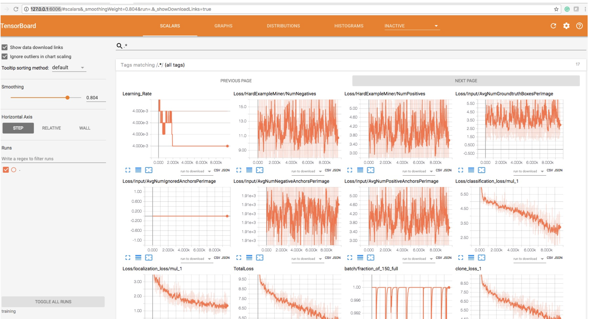
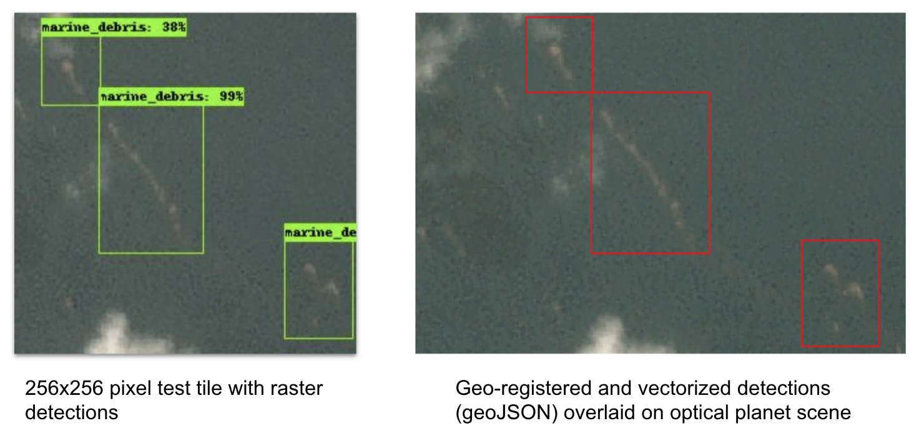

## Implementation

### 1. Model training and inference

We recommend creating a python 3.6+ virtual environment for this project. You can use [pyenv-virtualenv](https://github.com/pyenv/pyenv-virtualenv) to do so.

Install these Tensorflow versions in the activated environment.

```
tensorboard==1.14.0
tensorboard-plugin-wit==1.6.0.post3
tensorflow-estimator==1.14.0
tensorflow-gpu==1.14.0
```

### 2. Setup TensorFlow Object Detection API

#### 2a. Install TensorFlow object detection:

- Download the necessary scripts with `git clone https://github.com/tensorflow/models.git`
- Install TensorFlow Object Detection API by strictly following [these instructions](https://github.com/tensorflow/models/blob/master/research/object_detection/g3doc/tf1.md). Once you've successfully run `python object_detection/builders/model_builder_test.py` you are ready for the next step.
- To access the necessary utility scripts, you'll need to run all the following commands from the `models/research/object_detection` directory from the cloned repo. **From here on we will refer the TensorFlow Object Detection directory `models/research/object_detection/` as the TOD directory.**

You could also work from this [codebase](https://github.com/danieltyukov/marine-debris-ml-model/tree/main/object_detection_api) as a stable implementation with the above listed TF library versions. Just ensure that repo folder is set as `models/research/object_detection/`.

### 3. Create TFRecords for model training

Tensorflow API supports a variety of file formats. The TFRecord file format is a simple record-oriented binary format that many TensorFlow applications use. We have example code in this repo which converts the `labels.npz` file to a TFRecords file:

- Copy [`utils_convert_tfrecords.py` from this repo](https://github.com/danieltyukov/marine-debris-ml-model/blob/main/data_utils/utils_convert_tfrecords.py) to the TOD directory, .
- Your $folder will be the `data` path containing your `labels.npz` file and `tiles`.
- From the TOD directory run:

```shell
python3 utils_convert_tfrecords.py    \
        --label_input=$folder/labels.npz   \
        --data_dir=tf_records   \
        --tiles_dir=$folder/tiles    \
        --pbtxt=classes.pbtxt
```

This will create `train.record`, `val.record` and `test.record` files in a folder called `tf_records` in the TOD directory. Each record file contains different and non-overlapping partitions of the data (86,7,7 percents, respectively).

### 4. Object detection model setup

Now we're ready to set up the model architecture. For this walkthrough, we'll download a pre-trained model from the [TensorFlow model zoo](https://github.com/tensorflow/models/blob/master/research/object_detection/g3doc/tf1_detection_zoo.md). We'll demonstrate using [`ssd_resnet_101_fpn_oidv4`](http://download.tensorflow.org/models/object_detection/ssd_resnet101_v1_fpn_shared_box_predictor_oid_512x512_sync_2019_01_20.tar.gz) (download link):

- Download the model, unzip, and move the folder to the TOD directory
- Create a new folder `training` in the TOD directory.
- Copy a [model configuration file](https://github.com/danieltyukov/marine-debris-ml-model/blob/main/configs/ssd_resnet101_v1_fpn_marine_debris.config) to the `training directory`.
- Copy a [class definitions file](https://github.com/danieltyukov/marine-debris-ml-model/blob/main/configs/marine_debris.pbtxt) to the `data` directory.

Now your current directory should be `models/research/object_detection/` and in addition to the files included in that repo originally, your folder structure should look like this:

```
models/research/object_detection/
├── ssd_resnet101_v1_fpn_multilabel/
├── training/
│   └── ssd_resnet101_v1_fpn_marine_debris.config
├── data/
│   ├── train.record
│   ├── val.record
│   ├── test.record
│   ├── marine_debris.pbtxt
└───
```

### 5. Train the TensorFlow object detection model

You are now ready to train the model. From the `models/research/` directory, run:

```shell
#!/usr/bin/env bash
pyenv activate tf114_od
export PYTHONPATH=$PYTHONPATH:`pwd`:`pwd`/slim
cd object_detection
export CUDA_VISIBLE_DEVICES=0
python model_main.py --alsologtostderr --model_dir=training/ --pipeline_config_path=training/ssd_resnet101_v1_fpn_multilabel.config
```

The model checkpoints and outputs for this task will save in the `training` folder.

### 6. Visualize the Model

Using this [script](https://github.com/danieltyukov/marine-debris-ml-model/blob/v0_2/inference_utils/tf_od_predict_image_aug_to_geo_corrected.py), create the marine debris detection model inference graph with:

```shell
python export_inference_graph.py --input_type image_tensor \
              --pipeline_config_path training/ssd_resnet101_v1_fpn_multilabel.config \
              --trained_checkpoint_prefix training/model.ckpt-500000 \
              --output_directory model_50k
```

We can visualize this graph using [`tensorboard`](https://github.com/tensorflow/tensorboard):

```shell
tensorboard --logdir='training'
```

Go to `http://127.0.0.1:6006/` in your web browser and you will see:

<p align="center">

</p>

### 7. Prediction

Now let's run the model over our test tiles to predict where marine debris patches are. Copy [this script](https://github.com/danieltyukov/marine-debris-ml-model/blob/v0_2/inference_utils/tf_od_predict_image_aug_to_geo_corrected.py) to the TOD directory then run:

```shell
python tf_od_predict_image_aug_to_geo_corrected.py --model_name=model_50k \
                        --path_to_label=data/marine_debris.pbtxt \
                        --test_image_path=path/to/test/image/tiles
```

This code will read through all your test images in `path/to/test/image/tiles` folder and output the final prediction into the same folder. You will find new images in `test_image_path` with the `_test` suffixed to the end of the file basenames. The are images with the predicted bounding boxes and confidence scores plotted on top. As well, you will find a multipolygon geojson of predicted bounding boxes in the `test_image_path`.

Option for flags:

```
export base_dir=models/research/object_detection
export EXPORT_DIR=models/research/object_detection/model_50k
python3 ${base_dir}/tf_od_predict_image_aug_to_geo_corrected.py --model_name=${EXPORT_DIR} --path_to_label=${base_dir}/marine_debris.pbtxt --test_image_path=${base_dir}/test/
```

Detections geo-registered and vectorized to GeoJSON format:


### 8. Evaluation

You can use the [code](https://github.com/danieltyukov/marine-debris-ml-model/tree/main/evaluation_utils) in this folder to compute standard evaluation metrics with your model. Runtime and background instructions live [here](https://github.com/danieltyukov/marine-debris-ml-model/tree/main/evaluation_utils/evaluation.md).
