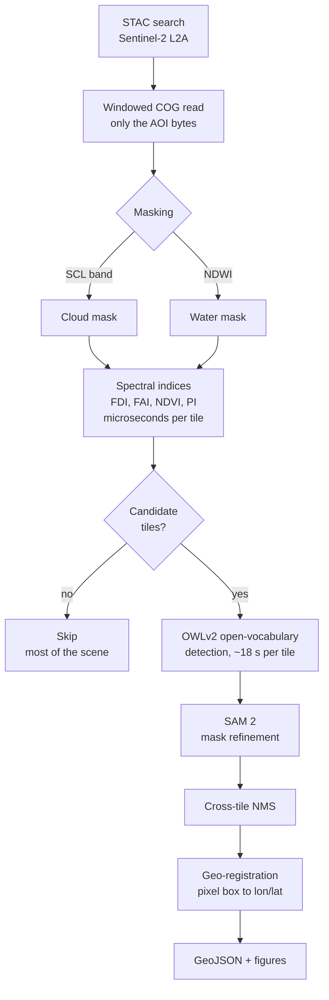

# Marine Debris Detection

Finding floating plastic in the ocean from satellite imagery, with open-vocabulary
detection, promptable segmentation and spectral indices.

The default pipeline needs **no training, no GPU and no API keys**. It reads free
Sentinel-2 imagery over HTTP and detects debris from text prompts.

```bash
pip install -e ".[all]"
mdebris detect --bbox -0.35,5.45,-0.05,5.65 --start 2024-01-01 --end 2024-06-30
```

---

## What this is

This project began as a NASA Space Apps entry built on TensorFlow 1.14 and the
TensorFlow Object Detection API, training an SSD-ResNet101-FPN for 500,000 steps to
detect a single class on commercial Planet imagery.

It has been rebuilt from the ground up. The parts worth keeping, the geo-referencing
math that turns pixel boxes into georeferenced polygons, were ported forward. Everything
else was replaced.

| | Before | Now |
|---|---|---|
| Framework | TensorFlow 1.14 | PyTorch 2.x |
| Python | 3.6 only | 3.11+ |
| Installable today | No, TF 1.14 has no wheel for Python 3.7+ | Yes |
| Detector | SSD-ResNet101-FPN | OWLv2 open-vocabulary, RT-DETRv2 supervised |
| Segmentation | None | SAM 2, box-prompted |
| Training to first prediction | 500k steps on GPU | None zero-shot, or ~2.5 min CPU supervised |
| Classes | 1 (`marine_debris`) | 9, including the confusers |
| Imagery | Planet, commercial | Sentinel-2, free and open |
| Credentials required | Planet API key | None |
| Vendored dependencies | 19 MB of TF OD API | None |
| Tests | None | Full suite, CI on 3.11 and 3.12 |
| Reported debris accuracy | None published | F1 0.515 on the MARIDA benchmark |
| Spectral indices | None | FDI, FAI, NDVI, NDWI, PI, kNDVI |

---

## How it works

The core constraint is that a modern vision transformer costs about 18 seconds per tile
on CPU, while a full Sentinel-2 scene is 120 megapixels. Running the detector everywhere
would take roughly 40 minutes per scene. Much of that scene is land, cloud or empty water
that cannot contain floating debris.

So the pipeline is a cascade. Cheap arithmetic screens the whole scene, and the expensive
model only looks where something interesting might be.

Measured on a real coastal scene off Accra
(`S2A_MSIL2A_20240527T100601_R022_T30NZM`, 53.7% water, 13.1% cloud, 36 tiles):

| | Tiles detected on | Detector time |
|---|---|---|
| Without cascade | 36 / 36 | 11.1 min |
| With cascade | 20 / 36 | 6.2 min |

That is **44% of detector calls avoided** on this scene. The saving scales with how much
of the scene is land or cloud, so it is largest on coastal and cloudy scenes and smallest
on open ocean, which is the cascade's worst case rather than its best.


```mermaid
flowchart TD
    A[STAC search<br/>Sentinel-2 L2A] --> B[Windowed COG read<br/>only the AOI bytes]
    B --> C{Masking}
    C -->|SCL band| D[Cloud mask]
    C -->|NDWI| E[Water mask]
    D --> F[Spectral indices<br/>FDI, FAI, NDVI, PI<br/>microseconds per tile]
    E --> F
    F --> G{Candidate<br/>tiles?}
    G -->|no| H[Skip<br/>most of the scene]
    G -->|yes| I[OWLv2 open-vocabulary<br/>detection, ~18 s per tile]
    I --> J[SAM 2<br/>mask refinement]
    J --> K[Cross-tile NMS]
    K --> L[Geo-registration<br/>pixel box to lon/lat]
    L --> M[GeoJSON + figures]
```

### An honest result: the vision model does not carry the signal at 10 m

This is the most important finding in the rewrite, and it is a negative one.

The same OWLv2 wrapper and weights were run on a natural photograph and on a Sentinel-2
chip:

| Input | Prompt | Confidence | Box size |
|---|---|---|---|
| COCO photo | "a remote control" | **0.794** | 1.9% of image |
| COCO photo | "a photo of a cat" | **0.669** | 44.6% (correct, the cat is large) |
| Sentinel-2 10 m | "white sea foam" | 0.210 | up to 100% of chip |
| Sentinel-2 10 m | "a boat wake" | 0.129 | whole chip |


The wrapper is correct: that COCO image is the canonical two-cats-two-remotes example
and the model localises it tightly. The satellite results are **domain mismatch**, not a
bug. OWLv2 is trained on web photographs where a target spans hundreds of pixels. At
10 m ground sample distance a 30 m debris patch spans **three pixels**, and the texture,
shape and context cues the model depends on are simply not present.

This is why the marine-litter literature uses index thresholding rather than deep
learning at Sentinel-2 resolution. The physics carries the signal; a photographic prior
does not.

### The trained model

"No training required" is good for adoption and bad for accuracy, and the table above
would oversell it without this section. A supervised classifier was trained on
**MARIDA** (Kikaki et al. 2022), the public Sentinel-2 marine-debris benchmark, using
its own scene-grouped split so no test scene leaks into training.

Gradient boosting over 18 per-pixel features: 11 reflectance bands plus FDI, FAI,
NDVI, NDWI, PI, kNDVI and MNDWI. **429412 training pixels, 194863 held-out test pixels,
76 seconds to fit on CPU with no GPU.**

| | precision | recall | F1 |
|---|---|---|---|
| Marine Debris, `argmax` default | 0.160 | 0.929 | 0.273 |
| Marine Debris, best-F1 threshold | **0.944** | 0.354 | **0.515** |


A single F1 misrepresents this. Debris is 0.2% of labelled pixels, so balanced class
weighting pushes the default hard toward recall. Sweeping the probability threshold
reaches **precision 0.944 at recall 0.354** instead. Which end is right depends on the
job: wide-area screening wants recall because a human reviews the hits, while
dispatching a cleanup vessel wants precision because a false positive costs a boat trip.

Best F1 of 0.515 sits below the Random Forest baseline the MARIDA paper reports. This
uses per-pixel spectra only, with no spatial context and no per-scene normalisation.

The most informative features are **B05** (red edge, 705 nm) and **B01** (coastal
aerosol, 443 nm), both outranking every named index. Neither appears in the FDI
formula, so the hand-built indices are not using all the available signal.


Real test-split output, cropped to the annotation. Rows 1 and 3 are debris filaments
at 95.6% and 95.5% agreement. Row 3 shows the honest failure: the bright object is a
**ship**, annotated pink, and the model paints it amber as debris. Per-pixel spectra
cannot separate a vessel from a debris raft, which is precisely what the
open-vocabulary detector is kept for.

```bash
python scripts/train_marida.py      # downloads MARIDA, trains, writes docs/marida_report.md
```

### What that means for the design

Spectral indices are the **primary detector** here, not a pre-filter for something
smarter. The Floating Debris Index (Biermann et al. 2020) measures how far a pixel's
near-infrared reflectance rises above a baseline interpolated between red and shortwave
infrared, which is a physical signature of floating material.

The open-vocabulary model still earns its place, for two things it does well:

**Rejecting confusers.** The original model had one class, `marine_debris`, making it
structurally unable to say "that is not debris, that is a ship". On the Accra chip OWLv2
labelled all eight detections `ship` or `ship_wake`; the 2019 model would have reported
eight debris patches. On the Limassol chip, 13 of 14 detections were foam, wake or
sediment, and one was debris. Low-confidence *localisation* still yields useful
*discrimination*.

**Higher-resolution imagery.** At Planet 3 m or drone centimetre resolution, objects
span enough pixels for the model to work as intended. The connector for that is in
`mdebris.data.planet`.

Sentinel-2 carries 13 bands. Using only three of them throws away most of the signal.

---

## Interactive report

An interactive write-up with a live explorer for the FDI threshold over the real measured
water distribution:

**https://danieltyukov.github.io/marine-debris-ml-model/**

The page is `docs/index.html`, regenerated by `python scripts/build_demo_page.py`.

## Figures

Every image below is a real artifact of this pipeline, regenerated by
`python -m mdebris.viz.figures`. None are screenshots.

Cascade screening, stage by stage, on the Accra chip:


Six spectral indices over the same water:


Why a fixed FDI threshold fails, and why tiles are 960 px:


Zero-shot OWLv2 detections, geo-registered:


---

## Measured performance

On 22 CPU cores, no GPU, in megapixels of source imagery per second:

| Tile size | Batch | s/tile | MP/s |
|---|---|---|---|
| 512 | 1 | 19.44 | 0.013 |
| **960** | **1** | **18.46** | **0.050** |
| 960 | 2 | 16.96 | 0.054 |
| 960 | 4 | 18.45 | 0.050 |

Two results shaped the design. OWLv2 resizes every input to 960x960 internally, so a
512 px tile pays full price for a quarter of the area: **tiling at 960 is a free 3.8x**.
And batching does nothing, because one forward pass already saturates the cores.

int8 dynamic quantization was measured at 14.36 s versus 18.25 s fp32, only 1.27x, so it
is not used.

---

## Install

```bash
git clone https://github.com/danieltyukov/marine-debris-ml-model.git
cd marine-debris-ml-model
python -m venv .venv && source .venv/bin/activate

# CPU-only torch, avoids pulling ~2.5 GB of unusable CUDA libraries
pip install --index-url https://download.pytorch.org/whl/cpu torch torchvision
pip install -e ".[all]"
```

---

## Data sources

| Purpose | Source | Credentials |
|---|---|---|
| Default imagery | Microsoft Planetary Computer, Sentinel-2 L2A | none |
| Fallback | AWS Open Data, earth-search | none |
| Benchmark | MARIDA, the public marine debris archive | none |
| Offline demo | sample chips bundled in this repo | none |
| Optional commercial | Planet | `PL_API_KEY` |

Reads are windowed. A cloud-optimized GeoTIFF is fetched with HTTP range requests, so
screening a coastline pulls kilobytes rather than downloading gigabyte scenes.

---

## License

MIT. See `LICENSE.md`.

Sentinel-2 data is free and open under Copernicus terms. MARIDA is released by its authors
under its own terms, see `mdebris.data.marida` for the citation.

## Citation

The spectral indices implemented here come from published work, cited in the docstring of
each function in `mdebris.indices.spectral`. The Floating Debris Index is from:

> Biermann, L., Clewley, D., Martinez-Vicente, V., Topouzelis, K. (2020).
> Finding Plastic Patches in Coastal Waters using Optical Satellite Data.
> *Scientific Reports* 10, 5364.
