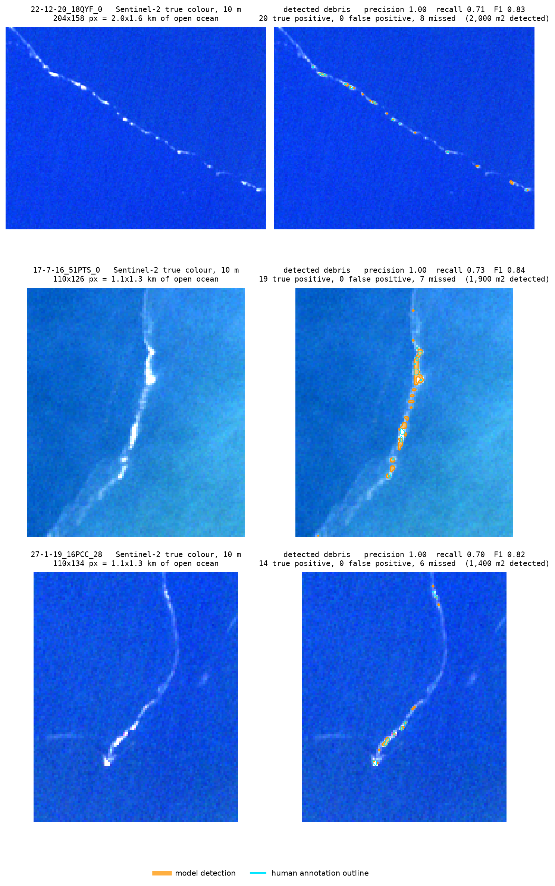
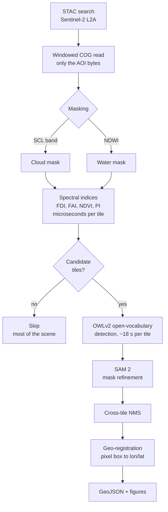
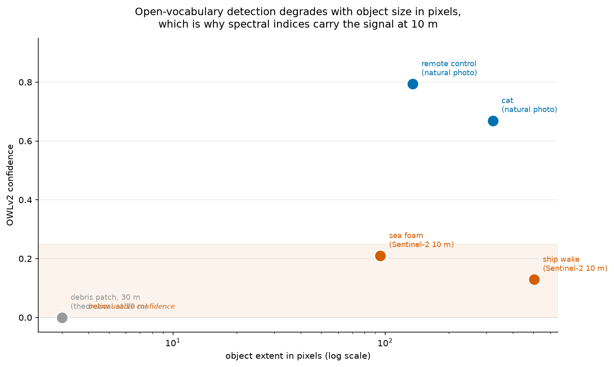
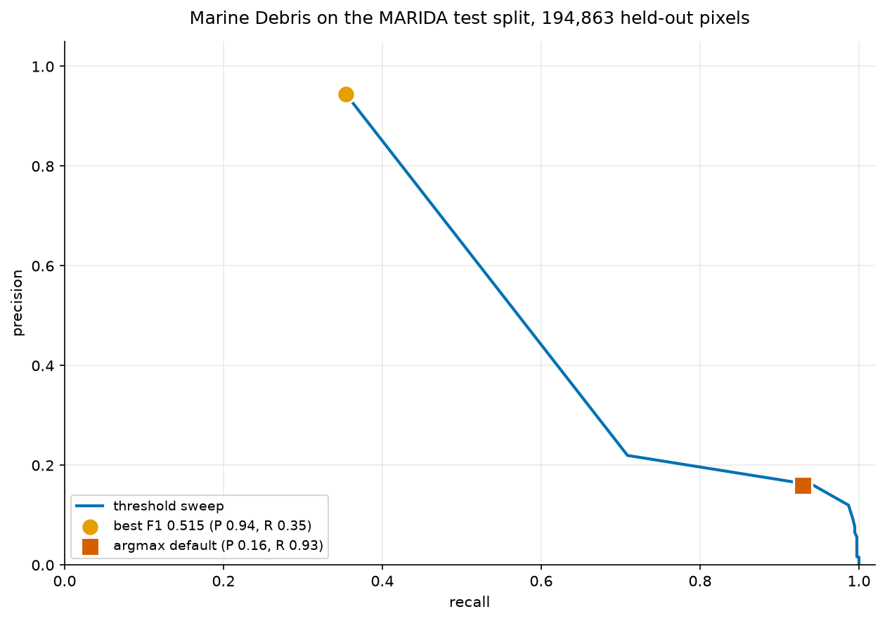
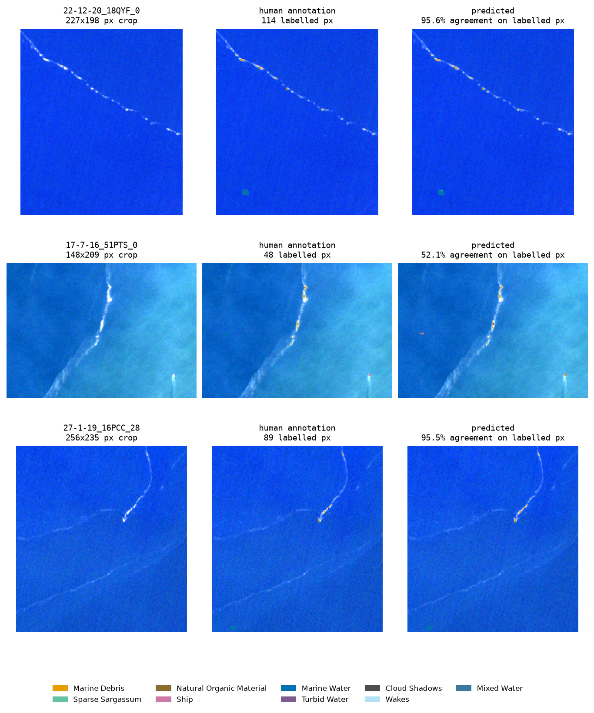
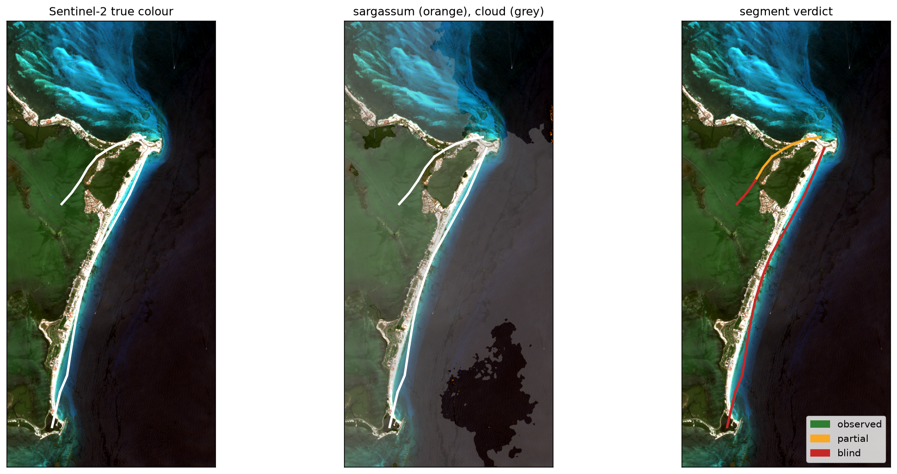
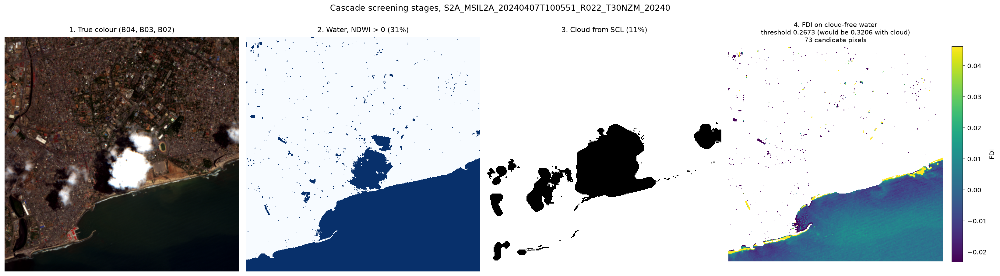
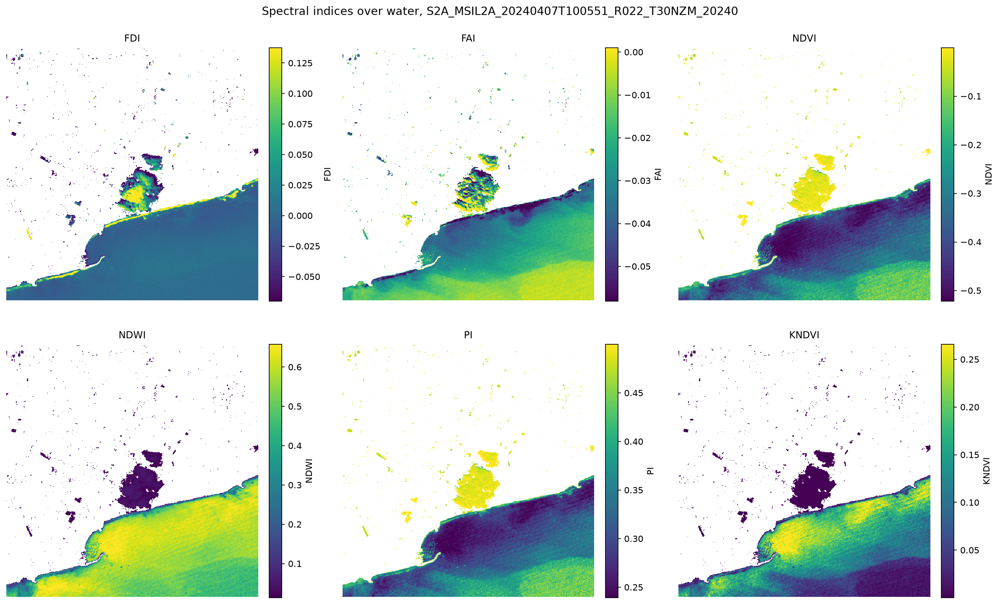
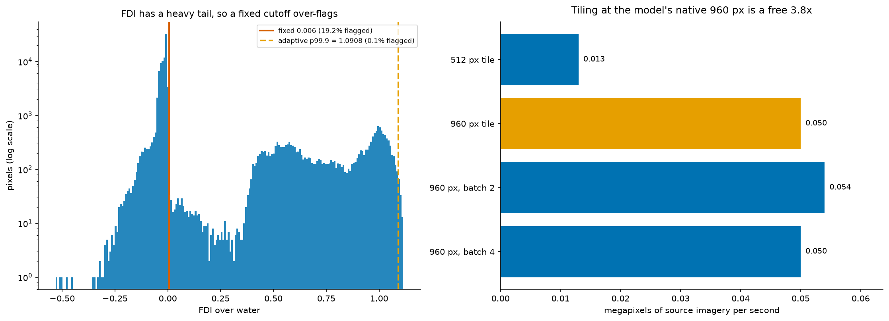
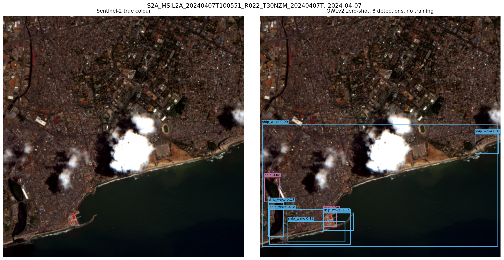

# Marine Debris Detection

Finding floating plastic in the ocean from satellite imagery, with open-vocabulary
detection, promptable segmentation and spectral indices.

The default pipeline needs **no training, no GPU and no API keys**. It reads free
Sentinel-2 imagery over HTTP and detects debris from text prompts.

```bash
pip install -e ".[all]"
mdebris detect --bbox -0.35,5.45,-0.05,5.65 --start 2024-01-01 --end 2024-06-30
```

---

## What this is

A rebuild of [NASA-IMPACT/marine_debris_ML](https://github.com/NASA-IMPACT/marine_debris_ML),
the NASA IMPACT marine debris detector. That project demonstrated that deep learning can
find floating debris in satellite imagery, using 1,370 hand-labelled bounding boxes on
commercial Planet imagery and an SSD-ResNet101-FPN, reporting **precision 0.78, recall
0.70, F1 0.74** on its test set.

This version keeps the idea and the geo-referencing math and replaces the rest.

| | NASA-IMPACT reference | This rebuild |
|---|---|---|
| Framework | TensorFlow 1.14 | PyTorch 2.x |
| Runs on current Python | No, TF 1.14 has no wheel for 3.7+ | Yes, 3.11 and 3.12 |
| Imagery | Planet 3 m, commercial | Sentinel-2 10 m, free and open |
| Credentials to run | Planet API key | **None** |
| Bands used | RGB (NIR listed as future work) | 11 bands, including NIR and SWIR |
| Spectral indices | None | FDI, FAI, NDVI, NDWI, PI, kNDVI, MNDWI |
| Classes | 1, `marine_debris` | 15, including the confusers |
| Training data | 1,370 private boxes, "dataset forthcoming" | MARIDA, public and citable |
| Reproducible benchmark | No, private test set | Yes, MARIDA scene-grouped split |
| Deployment for inference | Docker + AWS SQS pipeline | `pip install`, one CLI command |
| Segmentation | None | SAM 2, box-prompted |
| Tests / CI | None | 761 tests, GitHub Actions |
| Vendored dependencies | 19 MB of TF OD API | None |

### On comparing the numbers

The NASA-IMPACT F1 of 0.74 and the numbers below are **not directly comparable**, and
presenting them as a head-to-head would be misleading. They differ in data (private
Planet scenes vs public MARIDA), resolution (3 m vs 10 m, so their pixels are about 11
times smaller in area), and task (bounding-box object detection vs per-pixel
classification). A higher number here would not mean a better model.

What can be said fairly:

- Their 3 m imagery is a genuine advantage for small objects, and it costs money.
  This project trades resolution for being free and reproducible.
- They explicitly listed integrating the near-infrared channel as future work. This
  uses NIR and SWIR throughout, and the spectral bands turn out to matter more than
  the visible ones.
- Their test set was never published, so the score cannot be reproduced or contested.
  MARIDA can.

### Debris detection on open ocean

Real model output on MARIDA test scenes that are open water, at the high-precision
operating point. Orange is the model's detection, cyan outlines the human annotation.



| Scene | Area | Precision | Recall | F1 | TP / FP / missed |
|---|---|---|---|---|---|
| `22-12-20_18QYF_0` | 2.0 x 1.6 km | **1.00** | 0.71 | 0.83 | 20 / 0 / 8 |
| `17-7-16_51PTS_0` | 1.1 x 1.3 km | **1.00** | 0.73 | 0.84 | 19 / 0 / 7 |
| `27-1-19_16PCC_28` | 1.1 x 1.3 km | **1.00** | 0.70 | 0.82 | 14 / 0 / 6 |

Zero false positives across all three, catching roughly 71% of annotated debris pixels.
Open ocean is the harder case rather than the easier one: coastal scenes give a model
land and surf to key on, while here there is nothing in frame but water and the target.

Regenerate with `python scripts/make_ocean_detections.py`.

---

## How it works

The core constraint is that a modern vision transformer costs about 18 seconds per tile
on CPU, while a full Sentinel-2 scene is 120 megapixels. Running the detector everywhere
would take roughly 40 minutes per scene. Much of that scene is land, cloud or empty water
that cannot contain floating debris.

So the pipeline is a cascade. Cheap arithmetic screens the whole scene, and the expensive
model only looks where something interesting might be.

Measured on a real coastal scene off Accra
(`S2A_MSIL2A_20240527T100601_R022_T30NZM`, 53.7% water, 13.1% cloud, 36 tiles):

| | Tiles detected on | Detector time |
|---|---|---|
| Without cascade | 36 / 36 | 11.1 min |
| With cascade | 20 / 36 | 6.2 min |

That is **44% of detector calls avoided** on this scene. The saving scales with how much
of the scene is land or cloud, so it is largest on coastal and cloudy scenes and smallest
on open ocean, which is the cascade's worst case rather than its best.


```mermaid
flowchart TD
    A[STAC search<br/>Sentinel-2 L2A] --> B[Windowed COG read<br/>only the AOI bytes]
    B --> C{Masking}
    C -->|SCL band| D[Cloud mask]
    C -->|NDWI| E[Water mask]
    D --> F[Spectral indices<br/>FDI, FAI, NDVI, PI<br/>microseconds per tile]
    E --> F
    F --> G{Candidate<br/>tiles?}
    G -->|no| H[Skip<br/>most of the scene]
    G -->|yes| I[OWLv2 open-vocabulary<br/>detection, ~18 s per tile]
    I --> J[SAM 2<br/>mask refinement]
    J --> K[Cross-tile NMS]
    K --> L[Geo-registration<br/>pixel box to lon/lat]
    L --> M[GeoJSON + figures]
```

### An honest result: the vision model does not carry the signal at 10 m

This is the most important finding in the rewrite, and it is a negative one.

The same OWLv2 wrapper and weights were run on a natural photograph and on a Sentinel-2
chip:

| Input | Prompt | Confidence | Box size |
|---|---|---|---|
| COCO photo | "a remote control" | **0.794** | 1.9% of image |
| COCO photo | "a photo of a cat" | **0.669** | 44.6% (correct, the cat is large) |
| Sentinel-2 10 m | "white sea foam" | 0.210 | up to 100% of chip |
| Sentinel-2 10 m | "a boat wake" | 0.129 | whole chip |



The wrapper is correct: that COCO image is the canonical two-cats-two-remotes example
and the model localises it tightly. The satellite results are **domain mismatch**, not a
bug. OWLv2 is trained on web photographs where a target spans hundreds of pixels. At
10 m ground sample distance a 30 m debris patch spans **three pixels**, and the texture,
shape and context cues the model depends on are simply not present.

This is why the marine-litter literature uses index thresholding rather than deep
learning at Sentinel-2 resolution. The physics carries the signal; a photographic prior
does not.

### The trained model

"No training required" is good for adoption and bad for accuracy, and the table above
would oversell it without this section. A supervised classifier was trained on
**MARIDA** (Kikaki et al. 2022), the public Sentinel-2 marine-debris benchmark, using
its own scene-grouped split so no test scene leaks into training.

Gradient boosting over 18 per-pixel features: 11 reflectance bands plus FDI, FAI,
NDVI, NDWI, PI, kNDVI and MNDWI. **429412 training pixels, 194863 held-out test pixels,
76 seconds to fit on CPU with no GPU.**

| | precision | recall | F1 |
|---|---|---|---|
| Marine Debris, `argmax` default | 0.160 | 0.929 | 0.273 |
| Marine Debris, best-F1 threshold | **0.944** | 0.354 | **0.515** |



A single F1 misrepresents this. Debris is 0.2% of labelled pixels, so balanced class
weighting pushes the default hard toward recall. Sweeping the probability threshold
reaches **precision 0.944 at recall 0.354** instead. Which end is right depends on the
job: wide-area screening wants recall because a human reviews the hits, while
dispatching a cleanup vessel wants precision because a false positive costs a boat trip.

Best F1 of 0.515 sits below the Random Forest baseline the MARIDA paper reports. This
uses per-pixel spectra only, with no spatial context and no per-scene normalisation.

The most informative features are **B05** (red edge, 705 nm) and **B01** (coastal
aerosol, 443 nm), both outranking every named index. Neither appears in the FDI
formula, so the hand-built indices are not using all the available signal.



Real test-split output, cropped to the annotation. Rows 1 and 3 are debris filaments
at 95.6% and 95.5% agreement. Row 3 shows the honest failure: the bright object is a
**ship**, annotated pink, and the model paints it amber as debris. Per-pixel spectra
cannot separate a vessel from a debris raft, which is precisely what the
open-vocabulary detector is kept for.

```bash
python scripts/train_marida.py      # downloads MARIDA, trains, writes docs/marida_report.md
```

### The same model is a much better sargassum detector than a debris detector

The 0.515 above is the headline because this project set out to rebuild a *debris*
detector. It also buried the more useful half of the same training run.

MARIDA labels Dense and Sparse Sargassum as separate classes. Scored on the same
scene-grouped split, by the same model, on the same 18 features:

| task | precision | recall | F1 |
|---|---|---|---|
| Marine Debris, best F1 | 0.944 | 0.354 | 0.515 |
| Sparse Sargassum | 0.586 | 0.904 | 0.711 |
| Dense Sargassum | 0.946 | 0.920 | **0.933** |
| **Any sargassum, best F1** | **0.987** | 0.913 | **0.948** |
| Any sargassum, at 90% precision | 0.900 | **0.947** | 0.923 |

Nothing was retrained to get this. `scripts/eval_sargassum.py` loads the model
`train_marida.py` produced and re-scores it, so the numbers cannot drift apart.

The reason is physical, not statistical. Sargassum floats in mats tens of metres
across and carries a chlorophyll red edge, so it fills pixels and the indices key
on it directly. Debris is thin, low-contrast filaments that at 10 m span three
pixels. Same sensor, same model, different target.

The last row is the operating point that matters for anyone dispatching a crew:
90% precision, 94.7% recall. A false positive costs a shift.

**What this does not say.** MARIDA's sargassum labels are annotated Sentinel-2
pixels, not field observations, and a per-pixel benchmark score is not a validated
landfall forecast. Full breakdown, including what the model confuses sargassum with,
in [`docs/sargassum_report.md`](docs/sargassum_report.md).

**Where these pixels are.** Every sargassum pixel in the held-out split sits on tile
16PCC, 16PDC, 16PEC or 16QED: Motagua in Guatemala, Ulua and La Ceiba in Honduras,
and Roatan. All four are among the 18 Sentinel-2 tiles the LANOT platform at UNAM
processes operationally, so the benchmark measures this model over an area someone
already monitors for sargassum every five days. None of them are on the Mexican
stretch of that footprint.

### Beside the operational system

LANOT publish their detection rule in full, and it is not a learned model: five
hand-calibrated inequalities on L2A reflectance ([Arellano-Verdejo et al.
2025](https://doi.org/10.1038/s41598-025-93001-9)). Because the rule is published and
the tiles overlap, both can be run on the same held-out pixels.

They miss different things. 872 sargassum pixels are found only by this classifier,
41 only by the published rule, and just 13 of 1,641 by neither, a union recall of
0.992. Both are defeated by the same optically thin cloud, which is dark at 1610 nm
and so slips through the SWIR gate that rejects 61% of cloud otherwise.

```bash
python scripts/eval_lanot_operator.py
```

The comparison is a complementarity study, not a ranking, and the per-pixel numbers
for the published rule are its front gate without the segmentation and filtering that
follow it in the real pipeline. Read the caveats in
[`docs/lanot_comparison.md`](docs/lanot_comparison.md) before quoting anything from it.

LANOT report three sources of false detections in operation: the edges of thin cloud,
cloud shadows, and shallow water where the bottom shows through. MARIDA labels all
three as classes, so the pixels to test a mask against already exist inside their
footprint. [`docs/lanot_subset.csv.gz`](docs/lanot_subset.csv.gz) is every MARIDA
pixel on the four shared tiles annotated as one of those confusers or as sargassum,
with the 11 bands, coordinates, and whether the published rule fires.
[`docs/lanot_subset.md`](docs/lanot_subset.md) describes the columns and gives the
per-class baseline. The reflectance is ACOLITE Rayleigh-corrected, not Sen2Cor L2A,
which matters for both the rule and anyone evaluating ACOLITE.

```bash
python scripts/package_lanot_subset.py
```

### From detections to a beach a crew can be sent to

A GeoJSON of floating-material polygons is not something anyone schedules against.
A beach authority manages named stretches of coast, so `mdebris.coastal` rolls
detections onto them:

```bash
mdebris beaches detections.geojson --segments assets/qroo_segments.geojson --csv brief.csv
```

Three numbers come out per segment, and one of them is the point of the module:

- `coverage`, detected area over surf-zone area, comparable between segments
- `affected_front_m`, metres of shoreline with material within the surf zone
- `observability`, whether the beach was seen at all

The third is reported separately rather than folded into the first, because
optical detection over the Caribbean is cloud-limited badly enough that the two
get confused. LANOT, who run the nearest comparable Sentinel-2 platform, report
cloud above 90% regularly and describe a fully clear day over the region as close
to non-existent. A product that prints 0% coverage for a beach it could not see is
not being conservative, it is wrong, and it is wrong in the direction that sends
nobody to a beach that needed clearing.

Run end to end on the Cancun hotel zone, 6 July 2026, a real 75.5% cloud scene:

| segment | observed | cloud % | cover % | affected front m |
|---|---|---|---|---|
| Playa Caracol | partial | 67 | 0.00 | 0 |
| Playa Tortugas | partial | 67 | 0.00 | 0 |
| Playa Langosta | partial | 68 | 0.00 | 0 |
| Punta Nizuc | **blind** | 83 | — | — |
| Playa Delfines | **blind** | 96 | — | — |
| Playa Marlin | **blind** | 100 | — | — |

Seven of ten segments were not observed. A two-state product reports all ten as
clean.



Regenerate both the clear and the cloudy case with
`python scripts/make_beach_segments.py`. Reports land in
[`docs/beach_segments.md`](docs/beach_segments.md) and
[`docs/beach_segments_cloudy.md`](docs/beach_segments_cloudy.md).

One correctness note worth stating, because it changed the answer by an order of
magnitude. MARIDA has no land class: all 15 labels are sea-surface classes, so a
land pixel is forced into whichever marine category it resembles, and bright sand
resembles floating biomass. Running the classifier over a full scene without an
NDWI water gate produced 2,802 hits on the 29 July scene; gating on water left
160, all of them offshore. Ninety-four percent of the unguarded detections were
land.

### What that means for the design

Spectral indices are the **primary detector** here, not a pre-filter for something
smarter. The Floating Debris Index (Biermann et al. 2020) measures how far a pixel's
near-infrared reflectance rises above a baseline interpolated between red and shortwave
infrared, which is a physical signature of floating material.

The open-vocabulary model still earns its place, for two things it does well:

**Rejecting confusers.** The reference implementation had one class, `marine_debris`,
making it structurally unable to say "that is not debris, that is a ship". On the Accra
chip OWLv2 labelled all eight detections `ship` or `ship_wake`; a one-class detector
would have reported eight debris patches. On the Limassol chip, 13 of 14 detections were foam, wake or
sediment, and one was debris. Low-confidence *localisation* still yields useful
*discrimination*.

**Higher-resolution imagery.** At Planet 3 m or drone centimetre resolution, objects
span enough pixels for the model to work as intended. The connector for that is in
`mdebris.data.planet`.

Sentinel-2 carries 13 bands. Using only three of them throws away most of the signal.

---

## Interactive report

An interactive write-up with a live explorer for the FDI threshold over the real measured
water distribution:

**https://danieltyukov.github.io/marine-debris-ml-model/**

The page is `docs/index.html`, regenerated by `python scripts/build_demo_page.py`.

## Figures

Every image below is a real artifact of this pipeline, regenerated by
`python -m mdebris.viz.figures`. None are screenshots.

Cascade screening, stage by stage, on the Accra chip:



Six spectral indices over the same water:



Why a fixed FDI threshold fails, and why tiles are 960 px:



Zero-shot OWLv2 detections, geo-registered:



---

## Measured performance

On 22 CPU cores, no GPU, in megapixels of source imagery per second:

| Tile size | Batch | s/tile | MP/s |
|---|---|---|---|
| 512 | 1 | 19.44 | 0.013 |
| **960** | **1** | **18.46** | **0.050** |
| 960 | 2 | 16.96 | 0.054 |
| 960 | 4 | 18.45 | 0.050 |

Two results shaped the design. OWLv2 resizes every input to 960x960 internally, so a
512 px tile pays full price for a quarter of the area: **tiling at 960 is a free 3.8x**.
And batching does nothing, because one forward pass already saturates the cores.

int8 dynamic quantization was measured at 14.36 s versus 18.25 s fp32, only 1.27x, so it
is not used.

---

## Install

```bash
git clone https://github.com/danieltyukov/marine-debris-ml-model.git
cd marine-debris-ml-model
python -m venv .venv && source .venv/bin/activate

# CPU-only torch, avoids pulling ~2.5 GB of unusable CUDA libraries
pip install --index-url https://download.pytorch.org/whl/cpu torch torchvision
pip install -e ".[all]"
```

---

## Data sources

| Purpose | Source | Credentials |
|---|---|---|
| Default imagery | Microsoft Planetary Computer, Sentinel-2 L2A | none |
| Fallback | AWS Open Data, earth-search | none |
| Benchmark | MARIDA, the public marine debris archive | none |
| Offline demo | sample chips bundled in this repo | none |
| Optional commercial | Planet | `PL_API_KEY` |

Reads are windowed. A cloud-optimized GeoTIFF is fetched with HTTP range requests, so
screening a coastline pulls kilobytes rather than downloading gigabyte scenes.

---

## License

MIT. See `LICENSE.md`.

Sentinel-2 data is free and open under Copernicus terms. MARIDA is released by its authors
under its own terms, see `mdebris.data.marida` for the citation.

## Citation

The spectral indices implemented here come from published work, cited in the docstring of
each function in `mdebris.indices.spectral`. The Floating Debris Index is from:

> Biermann, L., Clewley, D., Martinez-Vicente, V., Topouzelis, K. (2020).
> Finding Plastic Patches in Coastal Waters using Optical Satellite Data.
> *Scientific Reports* 10, 5364.
