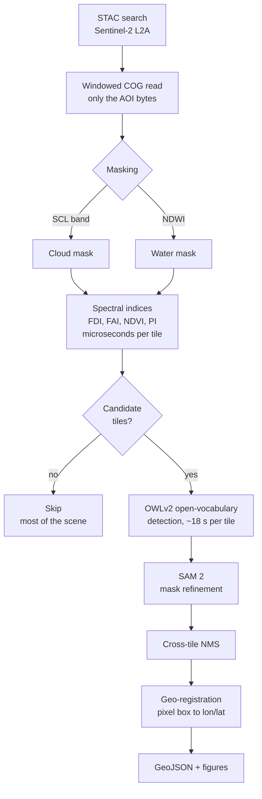

# Marine Debris Detection

Finding floating plastic in the ocean from satellite imagery, with open-vocabulary
detection, promptable segmentation and spectral indices.

The default pipeline needs **no training, no GPU and no API keys**. It reads free
Sentinel-2 imagery over HTTP and detects debris from text prompts.

```bash
pip install -e ".[all]"
mdebris detect --bbox -0.35,5.45,-0.05,5.65 --start 2024-01-01 --end 2024-06-30
```

---

## What this is

This project began as a NASA Space Apps entry built on TensorFlow 1.14 and the
TensorFlow Object Detection API, training an SSD-ResNet101-FPN for 500,000 steps to
detect a single class on commercial Planet imagery.

It has been rebuilt from the ground up. The parts worth keeping, the geo-referencing
math that turns pixel boxes into georeferenced polygons, were ported forward. Everything
else was replaced.

| | Before | Now |
|---|---|---|
| Framework | TensorFlow 1.14 | PyTorch 2.x |
| Python | 3.6 only | 3.11+ |
| Installable today | No, TF 1.14 has no wheel for Python 3.7+ | Yes |
| Detector | SSD-ResNet101-FPN | OWLv2 open-vocabulary, RT-DETRv2 supervised |
| Segmentation | None | SAM 2, box-prompted |
| Training to first prediction | 500k steps on GPU | None, zero-shot |
| Classes | 1 (`marine_debris`) | 9, including the confusers |
| Imagery | Planet, commercial | Sentinel-2, free and open |
| Credentials required | Planet API key | None |
| Vendored dependencies | 19 MB of TF OD API | None |
| Tests | None | Full suite, CI on 3.11 and 3.12 |
| Spectral indices | None | FDI, FAI, NDVI, NDWI, PI, kNDVI |

---

## How it works

The core constraint is that a modern vision transformer costs about 18 seconds per tile
on CPU, while a full Sentinel-2 scene is 120 megapixels. Running the detector everywhere
would take roughly 40 minutes per scene. Almost all of that scene is land, cloud or empty
water that cannot contain floating debris.

So the pipeline is a cascade. Cheap arithmetic screens the whole scene, and the expensive
model only looks where something interesting might be.


```mermaid
flowchart TD
    A[STAC search<br/>Sentinel-2 L2A] --> B[Windowed COG read<br/>only the AOI bytes]
    B --> C{Masking}
    C -->|SCL band| D[Cloud mask]
    C -->|NDWI| E[Water mask]
    D --> F[Spectral indices<br/>FDI, FAI, NDVI, PI<br/>microseconds per tile]
    E --> F
    F --> G{Candidate<br/>tiles?}
    G -->|no| H[Skip<br/>most of the scene]
    G -->|yes| I[OWLv2 open-vocabulary<br/>detection, ~18 s per tile]
    I --> J[SAM 2<br/>mask refinement]
    J --> K[Cross-tile NMS]
    K --> L[Geo-registration<br/>pixel box to lon/lat]
    L --> M[GeoJSON + figures]
```

### Why open-vocabulary detection

The original model had one class, `marine_debris`, which made it structurally unable to
say "that is not debris, that is seaweed". Sargassum mats, ship wakes and sea foam are
the dominant false positives in the marine-litter literature, and a one-class detector
has no way to express any of them.

OWLv2 takes text prompts at inference time. Asking it about debris *and* about the
confusers at once means a sargassum mat gets labelled sargassum instead of becoming a
false-positive debris detection. Adding a class is a config change, not a retraining job.

### Why spectral indices, not just a vision model

An RGB vision model sees a bright patch on dark water. A spectrometer sees why it is
bright. The Floating Debris Index (Biermann et al. 2020) measures how far a pixel's
near-infrared reflectance rises above a baseline interpolated between red and shortwave
infrared, which is a physical signature of floating material rather than a visual one.

Sentinel-2 carries 13 bands. Using only three of them throws away most of the signal.

---

## Measured performance

On 22 CPU cores, no GPU, in megapixels of source imagery per second:

| Tile size | Batch | s/tile | MP/s |
|---|---|---|---|
| 512 | 1 | 19.44 | 0.013 |
| **960** | **1** | **18.46** | **0.050** |
| 960 | 2 | 16.96 | 0.054 |
| 960 | 4 | 18.45 | 0.050 |

Two results shaped the design. OWLv2 resizes every input to 960x960 internally, so a
512 px tile pays full price for a quarter of the area: **tiling at 960 is a free 3.8x**.
And batching does nothing, because one forward pass already saturates the cores.

int8 dynamic quantization was measured at 14.36 s versus 18.25 s fp32, only 1.27x, so it
is not used.

---

## Install

```bash
git clone https://github.com/danieltyukov/marine-debris-ml-model.git
cd marine-debris-ml-model
python -m venv .venv && source .venv/bin/activate

# CPU-only torch, avoids pulling ~2.5 GB of unusable CUDA libraries
pip install --index-url https://download.pytorch.org/whl/cpu torch torchvision
pip install -e ".[all]"
```

---

## Data sources

| Purpose | Source | Credentials |
|---|---|---|
| Default imagery | Microsoft Planetary Computer, Sentinel-2 L2A | none |
| Fallback | AWS Open Data, earth-search | none |
| Benchmark | MARIDA, the public marine debris archive | none |
| Offline demo | sample chips bundled in this repo | none |
| Optional commercial | Planet | `PL_API_KEY` |

Reads are windowed. A cloud-optimized GeoTIFF is fetched with HTTP range requests, so
screening a coastline pulls kilobytes rather than downloading gigabyte scenes.

---

## License

MIT. See `LICENSE.md`.

Sentinel-2 data is free and open under Copernicus terms. MARIDA is released by its authors
under its own terms, see `mdebris.data.marida` for the citation.

## Citation

The spectral indices implemented here come from published work, cited in the docstring of
each function in `mdebris.indices.spectral`. The Floating Debris Index is from:

> Biermann, L., Clewley, D., Martinez-Vicente, V., Topouzelis, K. (2020).
> Finding Plastic Patches in Coastal Waters using Optical Satellite Data.
> *Scientific Reports* 10, 5364.
