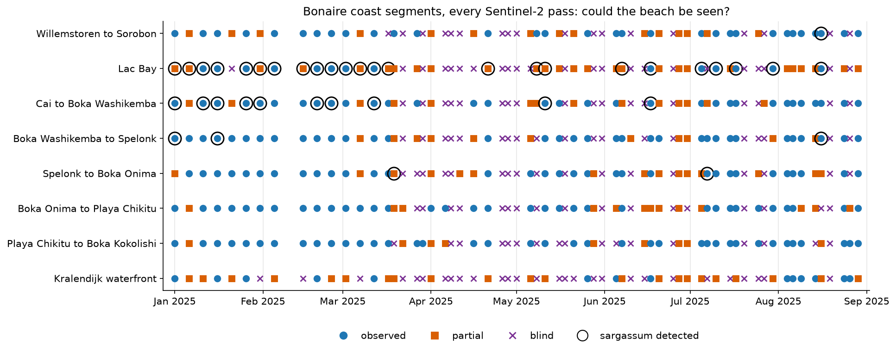
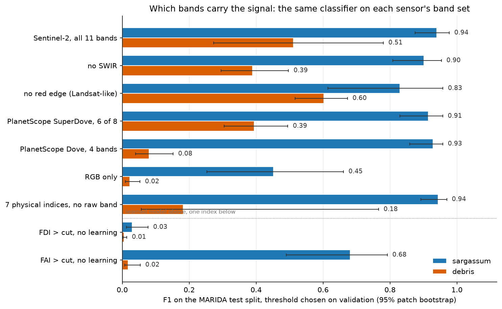
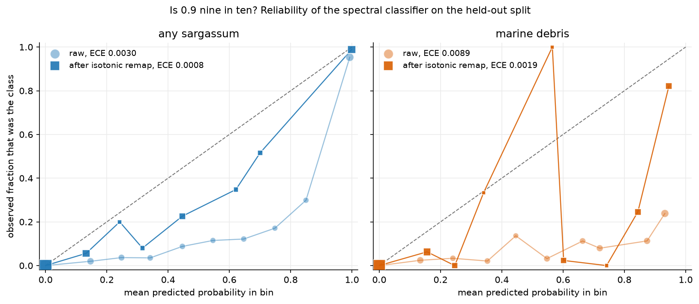
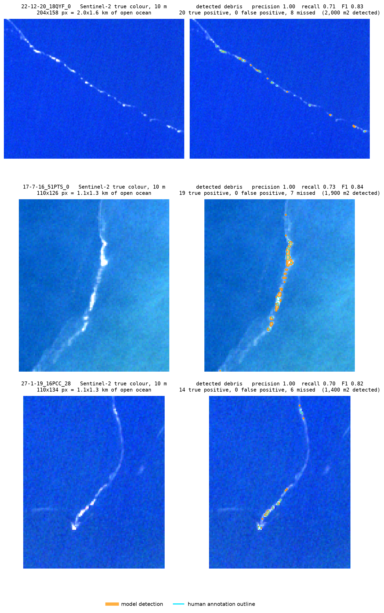

<p align="center">
  
</p>

<p align="center">Sargassum and marine debris detection on free Sentinel-2 imagery,<br>with calibrated probabilities and the cloud gaps reported per beach.</p>

<p align="center">
  <a href="https://github.com/danieltyukov/marine-debris-ml-model/actions/workflows/ci.yml"></a>
  <!-- Release badge, for after the first tagged release:
  <a href="https://github.com/danieltyukov/marine-debris-ml-model/releases"></a>
  -->
  <a href="LICENSE.md"></a>
  
</p>

<p align="center">
  <a href="https://danieltyukov.github.io/marine-debris-ml-model/">Website</a> ·
  <a href="#quick-start">Quick start</a> ·
  <a href="docs/RESULTS.md">Results</a> ·
  <a href="docs/ARCHITECTURE.md">How it works</a> ·
  <a href="CHANGELOG.md">Changelog</a>
</p>

mdebris finds floating material in Sentinel-2 imagery. It reads scenes over HTTP
with no account, API key or GPU, classifies every sea pixel with a model trained on
[MARIDA](https://doi.org/10.1371/journal.pone.0262247), the public Sentinel-2
marine-debris benchmark, and rolls the result onto named stretches of coast.

It started as a rebuild of NASA IMPACT's
[marine_debris_ML](https://github.com/NASA-IMPACT/marine_debris_ML), which needed
commercial 3 m Planet imagery and TensorFlow 1.14. Measuring the rebuild showed that
at 10 m the same model is a good sargassum detector and a weak debris detector, so
both results are reported here, with their error bars.

## What it does

- **Reads free imagery in place.** STAC search on Microsoft Planetary Computer, with
  AWS earth-search as a fallback, and windowed reads of cloud-optimised GeoTIFFs over
  HTTP range requests.
- **Classifies each pixel.** Gradient boosting over the 11 Sentinel-2 bands and seven
  spectral indices (FDI, FAI, NDVI, NDWI, PI, kNDVI, MNDWI), trained on MARIDA's
  scene-grouped split in 76 seconds on a CPU.
- **Calibrates the probability.** An isotonic remap fitted on the validation split,
  stored as JSON breakpoints. Each pixel is called sargassum (0.9 or more),
  uncertain (0.056 to 0.9) or clear.
- **Answers per beach.** Detections become coverage, metres of affected shoreline,
  and whether each stretch of coast was observed, partly observed or blind on that
  pass.
- **Runs whole seasons.** Every pass over an island, with the longest gap between
  usable looks and a check for flagged pixels that never move.
- **Keeps an open-vocabulary path.** OWLv2 detection and SAM 2 masks behind a
  spectral cascade, for telling ships and wakes from debris and for imagery fine
  enough for them to work.

Everything runs from the `mdebris` command line or a FastAPI service (`mdebris serve`).

## Quick start

Python 3.11 or 3.12. Install the CPU build of PyTorch first; it avoids about 2.5 GB
of CUDA libraries a CPU cannot use.

```sh
git clone https://github.com/danieltyukov/marine-debris-ml-model.git
cd marine-debris-ml-model
python -m venv .venv && source .venv/bin/activate
pip install --index-url https://download.pytorch.org/whl/cpu torch torchvision
pip install -e ".[all]"
```

Two Sentinel-2 chips ship with the package, so this works offline:

```sh
mdebris samples
mdebris indices --sample accra
```

Train the classifier and reproduce the results. The first run downloads MARIDA
(1.1 GB). The trained model is written to `models/` and never committed, because
joblib files are pickles.

```sh
python scripts/train_marida.py          # fits in about 76 s, writes docs/marida_report.md
python scripts/eval_sargassum.py        # the same model scored as a sargassum detector
python scripts/eval_band_ablation.py    # eight band sets, about two minutes
python scripts/eval_calibration.py      # reliability and the isotonic remap
```

Run a season over Bonaire, every pass from January to August 2025. It takes about 17
minutes over HTTP and resumes where it stopped.

```sh
python scripts/make_bonaire_segments.py --fetch
python scripts/run_bonaire_season.py
```

The open-vocabulary path downloads its model weights on first use:

```sh
mdebris detect --bbox -0.35,5.45,-0.05,5.65 --start 2024-01-01 --end 2024-06-30
```

## Results

Held-out MARIDA test split, 194,863 labelled pixels in 359 patches, with the
threshold chosen on the validation split. Intervals are 95% bootstrap intervals over
test patches.

| Target | Precision | Recall | F1 | 95% interval | Test pixels |
|---|---|---|---|---|---|
| Sargassum, dense or sparse | 0.952 | 0.928 | **0.940** | 0.87 to 0.98 | 1,641 |
| Marine debris | 0.414 | 0.667 | **0.511** | 0.27 to 0.78 | 381 |

| Calibration | ECE raw | ECE calibrated | Precision at 0.9 | Recall at 0.9 |
|---|---|---|---|---|
| Any sargassum | 0.0030 | **0.0008** | **0.989** | 0.907 |
| Marine debris | 0.0089 | 0.0019 | 0.822 | 0.496 |

- Sargassum fills pixels and carries a chlorophyll red edge; the seven indices alone
  score 0.944 and the four PlanetScope Dove bands 0.928. Debris needs the red edge
  and shortwave infrared, and drops to 0.080 on four bands.
- The calibrated sargassum probability can be read as a probability. The debris
  one cannot: raw scores between 0.9 and 1.0 were debris 24% of the time.
- **Bonaire, 64 passes from January to August 2025.** The windward coast was usable
  on 64% to 73% of passes, and the longest wait for a usable look was 15 to 20
  days. Lac Bay had no fully observed pass between 12 March and 17 June. The leeward
  control at Kralendijk was flagged on no pixel.
- Against LANOT's published sargassum rule on the four MARIDA tiles both cover, the
  two methods miss different pixels: together they find 1,628 of 1,641.

<!-- ISLANDS-RESULTS -->

The full tables, the protocols and what each number does not show are in
[docs/RESULTS.md](docs/RESULTS.md). An
[interactive report](https://danieltyukov.github.io/marine-debris-ml-model/report.html)
has the earlier measurements and an FDI threshold explorer.

## Key figures

Every pass over Bonaire for eight months, and whether each stretch of coast could be
seen:



The same classifier fitted on each sensor's band set:



Reliability before and after the isotonic remap:



Open-ocean debris on three MARIDA test scenes, with no false positives and about
71% of annotated pixels found:



## How it works

1. Search Sentinel-2 L2A over STAC and read only the bytes inside the area, with the
   reflectance offset the scene's processing baseline needs.
2. Mask cloud with the scene classification layer, and land with a coastline polygon
   buffered 15 m seaward. MARIDA has no land class, so bright sand would otherwise
   look like floating biomass.
3. Describe each pixel with 18 features, score it with the classifier, and remap the
   sargassum probability with the calibrator in `models/sargassum_calibration.json`.
4. Roll pixels onto segments of coast, keeping observability apart from coverage, so
   a beach under cloud is reported as not seen rather than as clean.

The open-vocabulary detector sits behind a spectral cascade that skipped 44% of
detector calls on a coastal scene off Accra. [docs/ARCHITECTURE.md](docs/ARCHITECTURE.md)
has the modules, the cascade, the throughput measurements and the reasoning behind
the design.

## Limitations

- Debris detection is weak at 10 m, because most litter is far smaller than a pixel.
  The held-out debris F1 is 0.511 with an interval from 0.27 to 0.78.
- No detection has been validated in the field. MARIDA's labels are annotated
  Sentinel-2 pixels, and a per-pixel score is not a landfall forecast.
- MARIDA has Caribbean sargassum labels (every sargassum pixel in its test split is
  off Guatemala or Honduras) but none from Aruba, Bonaire or Curaçao, and no shallow
  lagoon. What the classifier flags inside Lac Bay has not been checked on the
  ground.
- Probabilities are calibrated on MARIDA only. Over another coast a calibrated 0.9
  is an estimate until pixels from that coast have been checked.
- Optical imagery cannot see through cloud, and per-pixel spectra cannot tell a
  vessel from a debris raft.

## Data sources

| Purpose | Source | Credentials |
|---|---|---|
| Default imagery | Microsoft Planetary Computer, Sentinel-2 L2A | none |
| Fallback | AWS Open Data, earth-search | none |
| Benchmark | MARIDA, the public marine debris archive | none |
| Coastlines and segments | OpenStreetMap | none |
| Offline demo | sample chips bundled in this repo | none |
| Optional commercial | Planet | `PL_API_KEY` |

Sentinel-2 data is free and open under Copernicus terms. MARIDA is released by its
authors under CC BY 4.0. The Bonaire segments and island polygon are ODbL, from
OpenStreetMap.

## Contributing

Issues and pull requests are welcome. [CONTRIBUTING.md](CONTRIBUTING.md) covers the
environment, the tests and ruff, the data you need, and how to add an island or a
spectral index. To ask for a new region, use the "New region or island" issue
template. Report security problems privately, as described in
[SECURITY.md](SECURITY.md).

## Citation

If you use this software, cite it with the metadata in [CITATION.cff](CITATION.cff)
(GitHub shows it under "Cite this repository"), and cite MARIDA for the training
data:

> Kikaki, K., Kakogeorgiou, I., Mikeli, P., Raitsos, D. E., Karantzalos, K. (2022).
> MARIDA: A benchmark for Marine Debris detection from Sentinel-2 remote sensing
> data. *PLOS ONE* 17(1), e0262247. https://doi.org/10.1371/journal.pone.0262247

The spectral indices come from published work, cited in the docstring of each
function in `mdebris.indices.spectral`. The Floating Debris Index is from:

> Biermann, L., Clewley, D., Martinez-Vicente, V., Topouzelis, K. (2020).
> Finding Plastic Patches in Coastal Waters using Optical Satellite Data.
> *Scientific Reports* 10, 5364.

## License

MIT. See [LICENSE.md](LICENSE.md).
