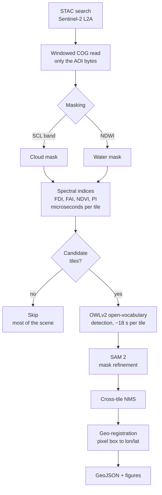
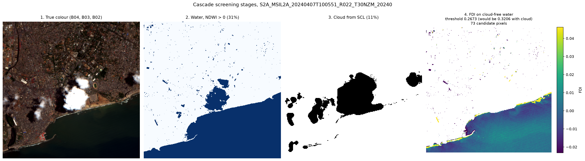
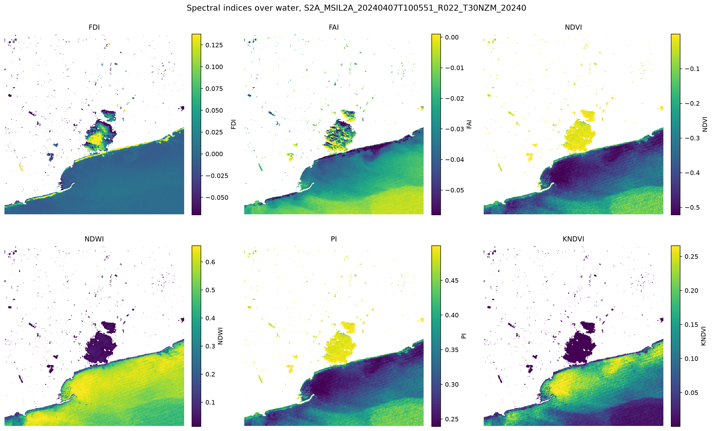
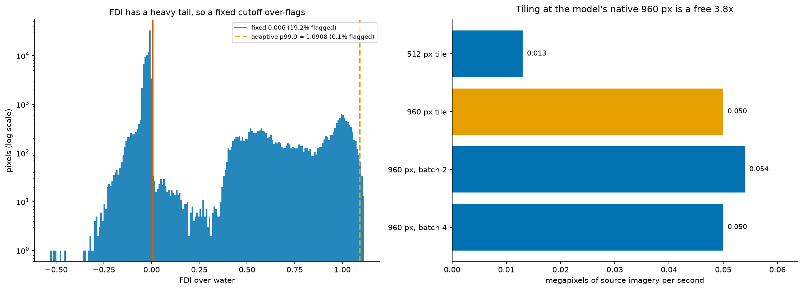
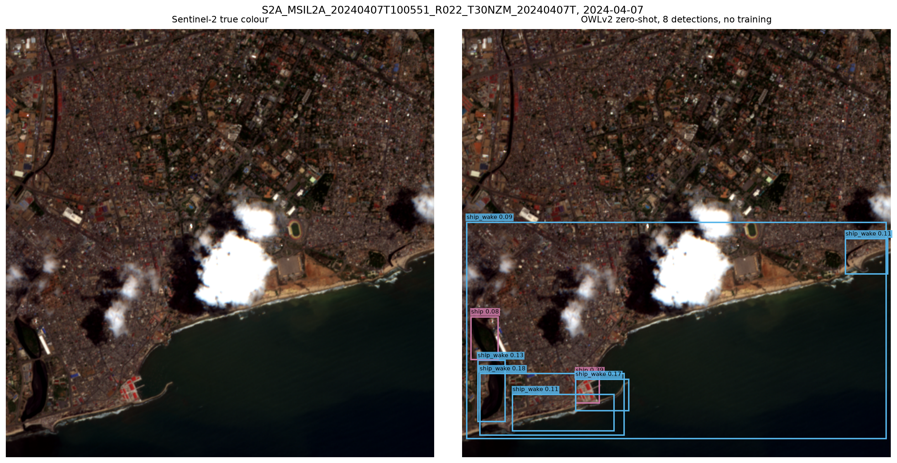

# Architecture

How mdebris is put together, how it differs from the NASA-IMPACT project it
rebuilds, and the measurements behind the less obvious design decisions. The
README covers installing and running it, and [RESULTS.md](RESULTS.md) has the
accuracy numbers. This page is for people changing the code.

## What changed from the reference

[NASA-IMPACT/marine_debris_ML](https://github.com/NASA-IMPACT/marine_debris_ML)
showed that a deep detector can find floating debris in commercial 3 m imagery.
This version keeps the idea and the geo-referencing math and replaces the rest.

| | NASA-IMPACT reference | This rebuild |
|---|---|---|
| Framework | TensorFlow 1.14 | PyTorch 2.x |
| Runs on current Python | No, TF 1.14 has no wheel for 3.7+ | Yes, 3.11 and 3.12 |
| Imagery | Planet 3 m, commercial | Sentinel-2 10 m, free and open |
| Credentials to run | Planet API key | **None** |
| Bands used | RGB (NIR listed as future work) | 11 bands, including NIR and SWIR |
| Spectral indices | None | FDI, FAI, NDVI, NDWI, PI, kNDVI, MNDWI |
| Classes | 1, `marine_debris` | 15, including the confusers |
| Training data | 1,370 private boxes, "dataset forthcoming" | MARIDA, public and citable |
| Reproducible benchmark | No, private test set | Yes, MARIDA scene-grouped split |
| Deployment for inference | Docker + AWS SQS pipeline | `pip install`, one CLI command |
| Segmentation | None | SAM 2, box-prompted |
| Tests / CI | None | 894 tests, GitHub Actions |
| Vendored dependencies | 19 MB of TF OD API | None |

Why the two projects' scores cannot be compared head to head is in
[RESULTS.md](RESULTS.md#comparing-with-the-nasa-impact-reference).

## Modules

Everything is in `src/mdebris/`:

| Module | Responsibility |
|---|---|
| `cli.py` | The `mdebris` commands: `samples`, `indices`, `search`, `detect`, `evaluate`, `beaches`, `config`, `serve`, `export-geojson` |
| `api/` | The FastAPI service behind `mdebris serve`, and its request and response models |
| `config.py` | Settings from `MDEBRIS_*` environment variables, including the cache directory |
| `types.py` | The data contracts every module shares: boxes, detections, scene and tile references |
| `data/stac.py` | STAC search over Planetary Computer and earth-search, with band names normalised across providers |
| `data/scaling.py` | Stored integers to surface reflectance, including the processing-baseline offset |
| `data/marida.py` | Downloading, verifying and loading MARIDA |
| `data/samples.py` | The two Sentinel-2 chips bundled with the package, so nothing needs the network |
| `data/planet.py` | Optional Planet connector, kept for parity with the legacy pipeline |
| `geo/` | Windowed raster reads, band alignment, tile math, and pixel boxes to longitude and latitude |
| `indices/spectral.py` | The spectral indices and their registry, each carrying its citation |
| `indices/masks.py` | Cloud, water and candidate masks, the cheap front half of the cascade |
| `models/spectral.py` | The per-pixel gradient-boosting classifier trained on MARIDA |
| `models/zeroshot.py` | Open-vocabulary detectors (OWLv2 by default) |
| `models/segment.py` | Box-prompted SAM 2 mask refinement |
| `models/supervised.py` | RT-DETRv2 detection with a fine-tuning loop |
| `models/prompts.py` | Prompt sets, including the confusers |
| `pipeline/` | Scene orchestration and the screening cascade |
| `coastal/` | Detections rolled onto named stretches of coast, and seasons of passes reduced to gap statistics |
| `eval/` | Box matching and detection metrics, the band ablation, and calibration |
| `viz/` | Plotting primitives and the figures in `assets/` |

`scripts/` holds the runs that produce every report in `docs/` and every figure in
`assets/`:

| Script | Writes |
|---|---|
| `train_marida.py` | `models/marida_spectral.joblib` (not committed), `docs/marida_report.md` |
| `eval_sargassum.py` | `docs/sargassum_report.md` |
| `eval_band_ablation.py` | `docs/band_ablation.md` and `.json` |
| `eval_calibration.py` | `docs/calibration.md` and `.json`, `models/sargassum_calibration.json` |
| `plot_post_meeting_figures.py` | `assets/band_ablation.png`, `assets/calibration.png` from the JSON above |
| `eval_lanot_operator.py` | `docs/lanot_comparison.md` |
| `package_lanot_subset.py` | `docs/lanot_subset.csv.gz` and `.md` |
| `make_beach_segments.py` | `docs/beach_segments.md`, `docs/beach_segments_cloudy.md` and figures |
| `make_bonaire_segments.py` | `assets/bonaire_segments.geojson`, `assets/bonaire_island.geojson` |
| `run_bonaire_season.py` | `docs/bonaire_season.md`, `.csv`, `.json`, persistence and figures |
| `make_ocean_detections.py`, `make_classification_samples.py` | the open-ocean and per-patch figures |
| `build_demo_page.py` | `docs/index.html`, the interactive report |

## The cascade

A modern vision transformer costs about 18 seconds per tile on CPU, while a full
Sentinel-2 scene is 120 megapixels. Running the detector everywhere would take
roughly 40 minutes per scene, and much of that scene is land, cloud or empty water
that cannot contain floating debris.

So the detection pipeline is a cascade. Cheap arithmetic screens the whole scene,
and the expensive model only looks where something interesting might be.

Measured on a real coastal scene off Accra
(`S2A_MSIL2A_20240527T100601_R022_T30NZM`, 53.7% water, 13.1% cloud, 36 tiles):

| | Tiles detected on | Detector time |
|---|---|---|
| Without cascade | 36 / 36 | 11.1 min |
| With cascade | 20 / 36 | 6.2 min |

That is **44% of detector calls avoided** on this scene. The saving scales with how
much of the scene is land or cloud, so it is largest on coastal and cloudy scenes
and smallest on open ocean, which is the cascade's worst case rather than its best.

## The per-pixel path

The classifier path used for the sargassum results and the Bonaire season does not
need the cascade, because classifying a pixel is cheap:

1. Search and read the scene as above, converting stored integers to reflectance
   with the offset the scene's processing baseline requires.
2. Mask cloud with the scene classification layer.
3. Remove land with a coastline polygon buffered 15 m seaward. MARIDA has no land
   class, so a land pixel is forced into whichever sea-surface class it resembles,
   and bright sand resembles floating biomass. The NDWI water gate in the cascade
   would also do this, but it removes dense sargassum, which has the near-infrared
   of vegetation (see [RESULTS.md](RESULTS.md#bonaire-every-pass-of-one-season)).
4. Build 18 features per pixel: 11 bands and seven indices.
5. Score with the gradient-boosting model, then remap the sargassum probability
   with the isotonic calibrator in `models/sargassum_calibration.json`.
6. Call each pixel sargassum (calibrated 0.9 or more), uncertain (from 0.056 to
   0.9) or clear, and roll the pixels onto segments with
   `mdebris.coastal.aggregate_segments` and `segment_cloud_fractions`.

The calibrator is JSON breakpoints rather than a pickle on purpose: a trained
`.joblib` file can run code when loaded, so none is committed or distributed, and
the one model artifact the runners need from the repository is plain data.

## What the measurements meant for the design

Spectral indices are the **primary detector** here, not a pre-filter for something
smarter. The Floating Debris Index (Biermann et al. 2020) measures how far a
pixel's near-infrared reflectance rises above a baseline interpolated between red
and shortwave infrared, which is a physical signature of floating material.

The open-vocabulary model still earns its place, for two things it does well:

**Rejecting confusers.** The reference implementation had one class,
`marine_debris`, making it structurally unable to say "that is not debris, that is
a ship". On the Accra chip OWLv2 labelled all eight detections `ship` or
`ship_wake`; a one-class detector would have reported eight debris patches. On the
Limassol chip, 13 of 14 detections were foam, wake or sediment, and one was debris.
Low-confidence *localisation* still yields useful *discrimination*.

**Higher-resolution imagery.** At Planet 3 m or drone centimetre resolution,
objects span enough pixels for the model to work as intended. The connector for
that is in `mdebris.data.planet`.

Sentinel-2 carries 13 bands. Using only three of them throws away most of the
signal.

## Measured performance

On 22 CPU cores, no GPU, in megapixels of source imagery per second:

| Tile size | Batch | s/tile | MP/s |
|---|---|---|---|
| 512 | 1 | 19.44 | 0.013 |
| **960** | **1** | **18.46** | **0.050** |
| 960 | 2 | 16.96 | 0.054 |
| 960 | 4 | 18.45 | 0.050 |

Two results shaped the design. OWLv2 resizes every input to 960x960 internally, so
a 512 px tile pays full price for a quarter of the area: **tiling at 960 is a free
3.8x**. And batching does nothing, because one forward pass already saturates the
cores.

int8 dynamic quantization was measured at 14.36 s against 18.25 s for fp32, only
1.27x, so it is not used.

## Data sources

| Purpose | Source | Credentials |
|---|---|---|
| Default imagery | Microsoft Planetary Computer, Sentinel-2 L2A | none |
| Fallback | AWS Open Data, earth-search | none |
| Benchmark | MARIDA, the public marine debris archive | none |
| Offline demo | sample chips bundled in this repo | none |
| Optional commercial | Planet | `PL_API_KEY` |

Reads are windowed. A cloud-optimized GeoTIFF is fetched with HTTP range requests,
so screening a coastline pulls kilobytes rather than downloading gigabyte scenes.

## Figures of the pipeline

Every image below is a real artifact of this pipeline, regenerated by
`python -m mdebris.viz.figures`. None are screenshots.

Cascade screening, stage by stage, on the Accra chip:

Six spectral indices over the same water:

Why a fixed FDI threshold fails, and why tiles are 960 px:

Zero-shot OWLv2 detections, geo-registered:

## The site and the report

`site/` is the project page, deployed to GitHub Pages by
`.github/workflows/pages.yml`. `site/report.html` is a copy of `docs/index.html`,
the interactive report that `scripts/build_demo_page.py` writes, with the site's
icon in place of the original. After rebuilding the report, copy it across so the
deployed page matches.
