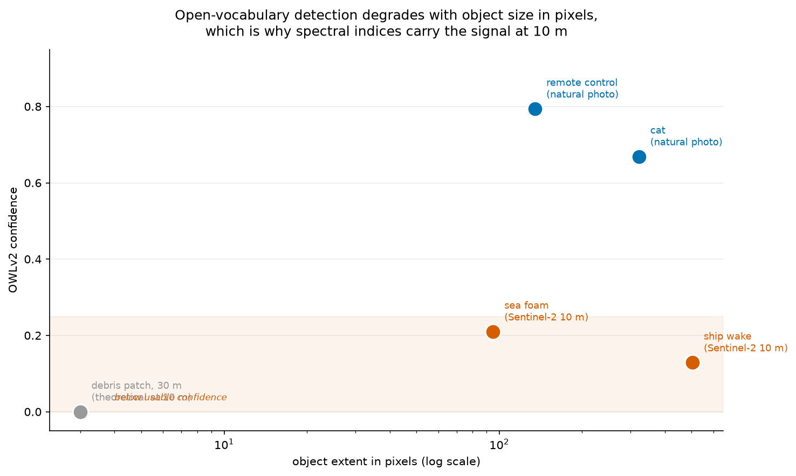
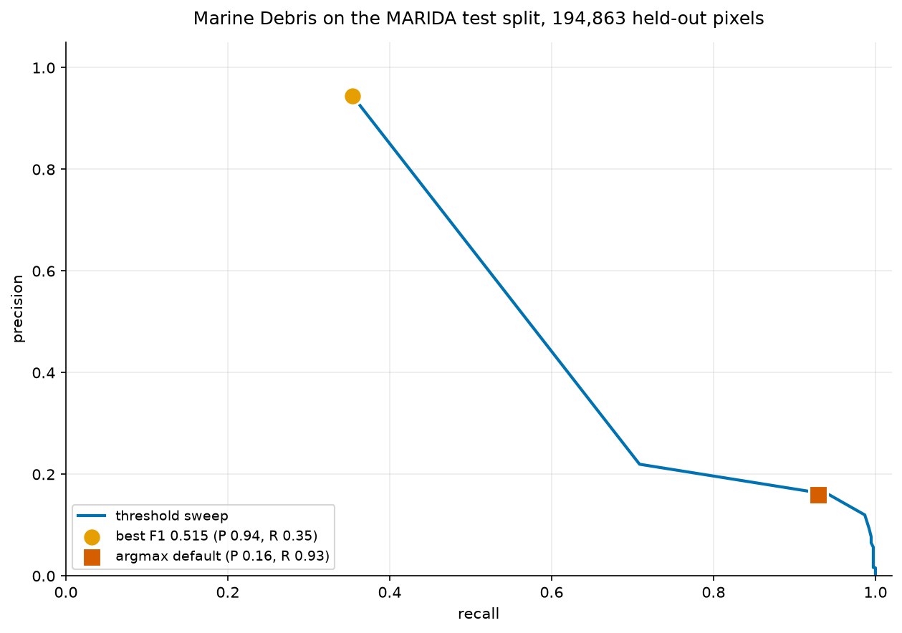
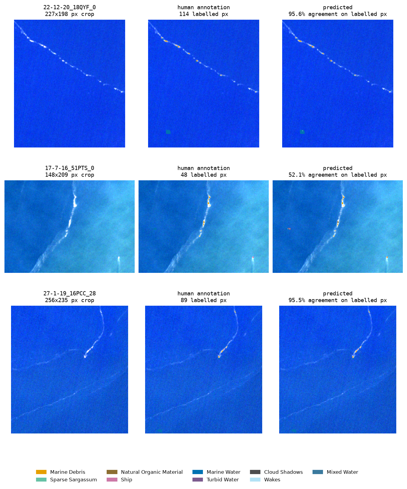
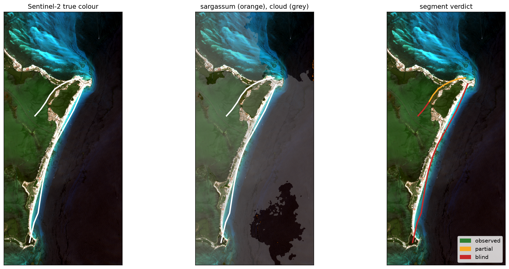
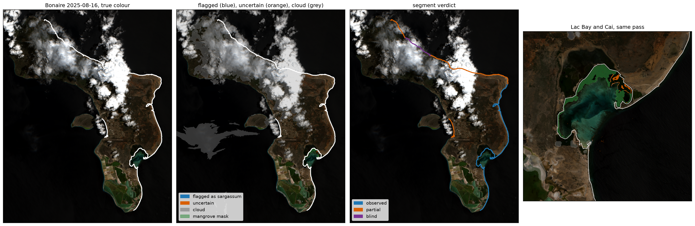
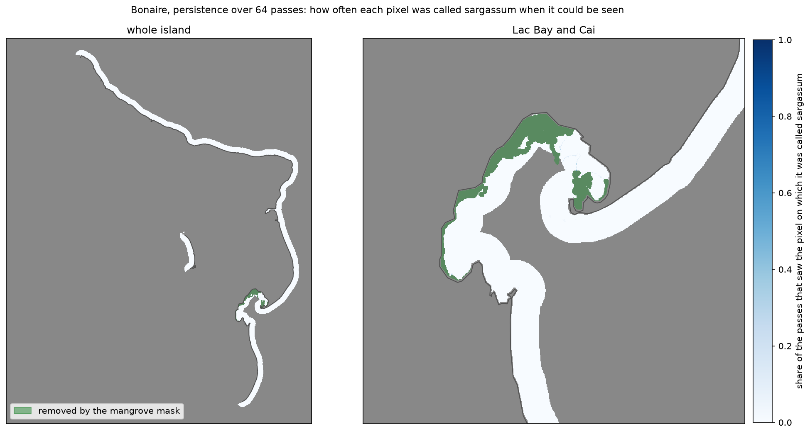

# Results

Every measurement this project has made, with the protocol behind each number and
what it does not show. The [README](../README.md) has the summary; the per-run
reports in this folder have the full tables. Each section names the script that
regenerates it. The scripts that only score the classifier load the trained model
rather than fitting a new one, so their numbers describe the same model.

- [How to read the numbers](#how-to-read-the-numbers)
- [Comparing with the NASA-IMPACT reference](#comparing-with-the-nasa-impact-reference)
- [The vision model does not carry the signal at 10 m](#the-vision-model-does-not-carry-the-signal-at-10-m)
- [The spectral classifier on MARIDA](#the-spectral-classifier-on-marida)
- [Debris on open ocean](#debris-on-open-ocean)
- [The same model is a much better sargassum detector](#the-same-model-is-a-much-better-sargassum-detector)
- [Beside the operational system](#beside-the-operational-system)
- [Which bands carry the signal](#which-bands-carry-the-signal)
- [Is the probability an uncertainty?](#is-the-probability-an-uncertainty)
- [From detections to a beach a crew can be sent to](#from-detections-to-a-beach-a-crew-can-be-sent-to)
- [Bonaire, every pass of one season](#bonaire-every-pass-of-one-season)

## How to read the numbers

All benchmark scores are on MARIDA (Kikaki et al. 2022), the public Sentinel-2
marine-debris benchmark, using its own scene-grouped split, so no test scene
leaks into training. The test split is 194,863 labelled pixels in 359 patches,
of which 1,641 are sargassum and 381 are debris.

Two protocols appear below, and they give different numbers for the same model:

- **Threshold chosen on the validation split, scored on test.** This is the honest
  one and the one the README leads with: sargassum F1 0.940 (95% interval 0.87 to
  0.98) and debris F1 0.511 (0.27 to 0.78), from
  [`band_ablation.md`](band_ablation.md).
- **Best F1 on the test split.** `train_marida.py` and `eval_sargassum.py` also
  report the threshold that maximises F1 on the test pixels themselves (debris
  0.656, sargassum 0.948). Choosing a threshold on the pixels you then score is
  optimistic by construction, and the gap between the two protocols is the size of
  that optimism.

Intervals are 95% percentile intervals from a cluster bootstrap over test patches,
because pixels in one patch share a scene and an annotator and are not
independent.

## Comparing with the NASA-IMPACT reference

This project is a rebuild of
[NASA-IMPACT/marine_debris_ML](https://github.com/NASA-IMPACT/marine_debris_ML). That
project showed that deep learning can find floating debris in satellite imagery,
using 1,370 hand-labelled bounding boxes on commercial Planet imagery and an
SSD-ResNet101-FPN, and reported **precision 0.78, recall 0.70, F1 0.74** on its
test set. [ARCHITECTURE.md](ARCHITECTURE.md) compares the two designs.

The NASA-IMPACT F1 of 0.74 and the numbers below are **not directly comparable**,
and presenting them as a head-to-head would be misleading. They differ in data
(private Planet scenes against public MARIDA), resolution (3 m against 10 m, so
their pixels are about 11 times smaller in area), and task (bounding-box object
detection against per-pixel classification). A higher number here would not mean a
better model.

What can be said fairly:

- Their 3 m imagery is a genuine advantage for small objects, and it costs money.
  This project trades resolution for being free and reproducible.
- They listed integrating the near-infrared channel as future work. This uses NIR
  and SWIR throughout, and the spectral bands turn out to matter more than the
  visible ones.
- Their test set was never published, so the score cannot be reproduced or
  contested. MARIDA can.

## The vision model does not carry the signal at 10 m

This is the most important finding in the rewrite, and it is a negative one.

The same OWLv2 wrapper and weights were run on a natural photograph and on a
Sentinel-2 chip:

| Input | Prompt | Confidence | Box size |
|---|---|---|---|
| COCO photo | "a remote control" | **0.794** | 1.9% of image |
| COCO photo | "a photo of a cat" | **0.669** | 44.6% (correct, the cat is large) |
| Sentinel-2 10 m | "white sea foam" | 0.210 | up to 100% of chip |
| Sentinel-2 10 m | "a boat wake" | 0.129 | whole chip |



The wrapper is correct: that COCO image is the canonical two-cats-two-remotes
example and the model localises it tightly. The satellite results are **domain
mismatch**, not a bug. OWLv2 is trained on web photographs where a target spans
hundreds of pixels. At 10 m ground sample distance a 30 m debris patch spans
**three pixels**, and the texture, shape and context cues the model depends on are
not present.

This is why the marine-litter literature uses index thresholding rather than deep
learning at Sentinel-2 resolution. The physics carries the signal; a photographic
prior does not.

## The spectral classifier on MARIDA

"No training required" is good for adoption and bad for accuracy, and the table
above would oversell it without this section. A supervised classifier was trained
on MARIDA using its own scene-grouped split.

Gradient boosting over 18 per-pixel features: 11 reflectance bands plus FDI, FAI,
NDVI, NDWI, PI, kNDVI and MNDWI. **429,412 training pixels, 194,863 held-out test
pixels, 76 seconds to fit on CPU with no GPU.**

| | precision | recall | F1 |
|---|---|---|---|
| Marine Debris, `argmax` default | 0.160 | 0.929 | 0.273 |
| Marine Debris, best-F1 threshold on test | **0.750** | 0.583 | **0.656** |
| Marine Debris, at 94% precision | 0.944 | 0.375 | 0.538 |
| Marine Debris, threshold chosen on validation | 0.414 | 0.667 | **0.511** |

The last row is from [`band_ablation.md`](band_ablation.md) and is the number to
quote; the rows above it pick their threshold on the test pixels.



A single F1 misrepresents this. Debris is 0.2% of labelled pixels, so balanced
class weighting pushes the default hard toward recall. Sweeping the probability
threshold reaches **precision 0.944 at recall 0.375** instead. Which end is right
depends on the job: wide-area screening wants recall because a human reviews the
hits, while dispatching a cleanup vessel wants precision because a false positive
costs a boat trip.

This uses per-pixel spectra only, with no spatial context and no per-scene
normalisation. The MARIDA paper's own baselines on this class (its Table 4) are F1
0.53 for the best Random Forest and 0.48 for its U-Net. The test-tuned 0.656 sits
above both; the validation-chosen 0.511 sits between them. An earlier version of
the README said the best debris F1 was 0.515. That number came from a previous
training run and was not updated when the shipped model was retrained;
`scripts/eval_calibration.py` and `scripts/eval_band_ablation.py` both re-derive the
figure from `models/marida_spectral.joblib`, so it cannot drift again. The debris
support is 381 test pixels in a handful of patches, and the patch-bootstrap
interval on the validation-chosen F1 runs from 0.27 to 0.78, which is the honest
width of any debris number from this benchmark.

The most informative feature is **B05** (red edge, 705 nm), ahead of every named
index. **B01** (coastal aerosol, 443 nm) is third, behind MNDWI and ahead of the
other six indices ([`marida_report.md`](marida_report.md)). Neither band appears in
the FDI formula, so the hand-built indices are not using all the available signal.



Real test-split output, cropped to the annotation. Rows 1 and 3 are debris
filaments at 95.6% and 95.5% agreement. Row 2 shows the failure: the bright object
at the bottom right is a **ship**, annotated pink, and the model paints it amber as
debris. Per-pixel spectra cannot separate a vessel from a debris raft, which is
what the open-vocabulary detector is kept for.

```bash
python scripts/train_marida.py      # downloads MARIDA, trains, writes docs/marida_report.md
```

## Debris on open ocean

Real model output on MARIDA test scenes that are open water, at the high-precision
operating point. Orange is the model's detection, cyan outlines the human
annotation.


| Scene | Area | Precision | Recall | F1 | TP / FP / missed |
|---|---|---|---|---|---|
| `22-12-20_18QYF_0` | 2.0 x 1.6 km | **1.00** | 0.71 | 0.83 | 20 / 0 / 8 |
| `17-7-16_51PTS_0` | 1.1 x 1.3 km | **1.00** | 0.73 | 0.84 | 19 / 0 / 7 |
| `27-1-19_16PCC_28` | 1.1 x 1.3 km | **1.00** | 0.70 | 0.82 | 14 / 0 / 6 |

Zero false positives across all three, catching roughly 71% of annotated debris
pixels. Open ocean is the harder case rather than the easier one: coastal scenes
give a model land and surf to key on, while here there is nothing in frame but
water and the target.

```bash
python scripts/make_ocean_detections.py
```

## The same model is a much better sargassum detector

The debris numbers are the headline because this project set out to rebuild a
*debris* detector. The same training run has a more useful half.

MARIDA labels Dense and Sparse Sargassum as separate classes. Scored on the same
scene-grouped split, by the same model, on the same 18 features:

| task | precision | recall | F1 |
|---|---|---|---|
| Marine Debris, best F1 on test | 0.750 | 0.583 | 0.656 |
| Sparse Sargassum | 0.586 | 0.904 | 0.711 |
| Dense Sargassum | 0.946 | 0.920 | **0.933** |
| **Any sargassum, best F1 on test** | **0.987** | 0.913 | **0.948** |
| Any sargassum, at 90% precision | 0.900 | **0.947** | 0.923 |
| Any sargassum, threshold chosen on validation | 0.952 | 0.928 | **0.940** |

Nothing was retrained to get this. `scripts/eval_sargassum.py` loads the model
`train_marida.py` produced and re-scores it, so the numbers cannot drift apart.
The last row is from [`band_ablation.md`](band_ablation.md), with its interval of
0.87 to 0.98.

The reason is physical, not statistical. Sargassum floats in mats tens of metres
across and carries a chlorophyll red edge, so it fills pixels and the indices key
on it directly. Debris is thin, low-contrast filaments that at 10 m span three
pixels. Same sensor, same model, different target.

The 90%-precision row is the operating point that matters for anyone dispatching
a crew: 90% precision, 94.7% recall. A false positive costs a shift.

**What this does not say.** MARIDA's sargassum labels are annotated Sentinel-2
pixels, not field observations, and a per-pixel benchmark score is not a validated
landfall forecast. The full breakdown, including what the model confuses sargassum
with, is in [`sargassum_report.md`](sargassum_report.md).

**Where these pixels are.** Every sargassum pixel in the held-out split sits on tile
16PCC, 16PDC, 16PEC or 16QED: Motagua in Guatemala, Ulua and La Ceiba in Honduras,
and Roatan. All four are among the 18 Sentinel-2 tiles the LANOT platform at UNAM
processes operationally, so the benchmark measures this model over an area someone
already monitors for sargassum every five days. None of them are on the Mexican
stretch of that footprint.

## Beside the operational system

LANOT publish their detection rule in full, and it is not a learned model: five
hand-calibrated inequalities on L2A reflectance ([Arellano-Verdejo et al.
2025](https://doi.org/10.1038/s41598-025-93001-9)). Because the rule is published
and the tiles overlap, both can be run on the same held-out pixels.

They miss different things. 872 sargassum pixels are found only by this
classifier, 41 only by the published rule, and just 13 of 1,641 by neither, a
union recall of 0.992. Both are defeated by the same optically thin cloud, which is
dark at 1610 nm and so slips through the SWIR gate that rejects 61% of cloud
otherwise.

```bash
python scripts/eval_lanot_operator.py
```

The comparison is a complementarity study, not a ranking, and the per-pixel
numbers for the published rule are its front gate without the segmentation and
filtering that follow it in the real pipeline. Read the caveats in
[`lanot_comparison.md`](lanot_comparison.md) before quoting anything from it.

LANOT report three sources of false detections in operation: the edges of thin
cloud, cloud shadows, and shallow water where the bottom shows through. MARIDA
labels all three as classes, so the pixels to test a mask against already exist
inside their footprint. [`lanot_subset.csv.gz`](lanot_subset.csv.gz) is every
MARIDA pixel on the four shared tiles annotated as one of those confusers or as
sargassum, with the 11 bands, coordinates, and whether the published rule fires.
[`lanot_subset.md`](lanot_subset.md) describes the columns and gives the per-class
baseline. The reflectance is ACOLITE Rayleigh-corrected, not Sen2Cor L2A, which
matters for both the rule and anyone evaluating ACOLITE.

```bash
python scripts/package_lanot_subset.py
```

Neither script touches the torch stack. From a clean clone, `pip install -e .
pandas scikit-learn` is enough to run them; `eval_lanot_operator.py` also needs the
model that `train_marida.py` writes, which downloads MARIDA (1.1 GB) on first run.

## Which bands carry the signal

Every optical satellite has a different band set, and the NASA IMPACT labels this
project started from were drawn on 4-band PlanetScope imagery with no red edge and
no shortwave infrared. Before comparing this model at 10 m against that imagery at
3 m, the question is how much of the 10 m score lives in bands a 3 m sensor does
not have. So the same classifier was fitted on the band set of each sensor, with
any index that needs a dropped band dropped with it, thresholds chosen on MARIDA's
validation split and applied to the test split.


| bands kept | stands for | sargassum F1 | debris F1 |
|---|---|---|---|
| all 11 | Sentinel-2 | 0.940 | 0.511 |
| no B11, B12 | no shortwave infrared | 0.901 | 0.389 |
| no B05, B06, B07, B8A | Landsat-like | 0.830 | 0.602 |
| B01 to B05, B08 | PlanetScope SuperDove | 0.914 | 0.394 |
| B02, B03, B04, B08 | PlanetScope Dove, the NASA IMPACT imagery | **0.928** | **0.080** |
| B02, B03, B04 | RGB | 0.452 | 0.023 |
| the 7 indices only | physics, no raw band | **0.944** | 0.182 |
| FAI above one cut | one index, no learning | 0.681 | 0.017 |

Two things fall out. Sargassum is carried by the visible-plus-NIR spectrum: the
seven physical indices alone match the full model, and the 4-band Dove set costs
one point of F1. Debris is not. It needs the red edge and SWIR bands (0.080 on
Dove-4) and it needs learned combinations of raw bands rather than the indices
(0.182 on indices alone). A 3 m against 10 m comparison will therefore be a
resolution comparison for sargassum and a resolution-plus-bands comparison for
debris, and has to be reported as such. The intervals, both index baselines and the
protocol are in [`band_ablation.md`](band_ablation.md). The debris intervals are
wide, because 381 test pixels in a handful of patches is what MARIDA has.

```bash
python scripts/eval_band_ablation.py     # fits eight models, about two minutes on CPU
```

## Is the probability an uncertainty?

A map handed to an administration is expected to come with uncertainties, and a
probability is only one if 0.9 means nine in ten. Scored on the held-out split, the
sargassum probability nearly is: expected calibration error 0.003 raw and 0.0008
after an isotonic remap fitted on the validation split. The debris probability is
not. Pixels scored between 0.9 and 1.0 were debris 24% of the time, and the remap
lifts that to 82% only by moving most of them down.


The remap is stored as breakpoints in `models/sargassum_calibration.json`, no
pickle, and the Bonaire runner below applies it. With calibrated probabilities the
operating point is its own statement: at or above 0.9 the model's estimate is nine
in ten, and on the test split that cut gives **precision 0.989 at recall 0.907** for
sargassum. Between the edge that keeps 98% of true sargassum (0.056) and 0.9 the
model reports a third state, uncertain, instead of a yes or a no; 1,859 of 194,863
test pixels land there, 137 of them sargassum. Full tables are in
[`calibration.md`](calibration.md).

```bash
python scripts/eval_calibration.py
```

## From detections to a beach a crew can be sent to

A GeoJSON of floating-material polygons is not something anyone schedules against.
A beach authority manages named stretches of coast, so `mdebris.coastal` rolls
detections onto them:

```bash
mdebris beaches detections.geojson --segments assets/qroo_segments.geojson --csv brief.csv
```

Three numbers come out per segment, and the third is the point of the module:

- `coverage`, detected area over surf-zone area, comparable between segments
- `affected_front_m`, metres of shoreline with material within the surf zone
- `observability`, whether the beach was seen at all

Observability is reported separately rather than folded into coverage, because
optical detection over the Caribbean is cloud-limited badly enough that the two get
confused. LANOT, who run the nearest comparable Sentinel-2 platform, report cloud
above 90% regularly and describe a fully clear day over the region as close to
non-existent. A product that prints 0% coverage for a beach it could not see is not
being conservative, it is wrong, and it is wrong in the direction that sends nobody
to a beach that needed clearing.

Run end to end on the Cancun hotel zone, 6 July 2026, a real 75.5% cloud scene:

| segment | observed | cloud % | cover % | affected front m |
|---|---|---|---|---|
| Playa Caracol | partial | 67 | 0.00 | 0 |
| Playa Tortugas | partial | 67 | 0.00 | 0 |
| Playa Langosta | partial | 68 | 0.00 | 0 |
| Punta Nizuc | **blind** | 83 | - | - |
| Playa Delfines | **blind** | 96 | - | - |
| Playa Marlin | **blind** | 100 | - | - |

Seven of ten segments were not observed; the full list is in
[`beach_segments_cloudy.md`](beach_segments_cloudy.md). A two-state product reports
all ten as clean.



Both the clear and the cloudy case regenerate with
`python scripts/make_beach_segments.py`. Reports land in
[`beach_segments.md`](beach_segments.md) and
[`beach_segments_cloudy.md`](beach_segments_cloudy.md).

One correctness note, because it changed the answer by an order of magnitude.
MARIDA has no land class: all 15 labels are sea-surface classes, so a land pixel is
forced into whichever marine category it resembles, and bright sand resembles
floating biomass. Running the classifier over a full scene without an NDWI water
gate produced 2,802 hits on the 29 July scene; gating on water left 160, all of them
offshore. Ninety-four percent of the unguarded detections were land. The Bonaire
season below found that the gate has its own cost and replaced it with a coastline.

## Bonaire, every pass of one season

The Cancun brief is one pass over one coast. A monitoring proposal for a small
island has to answer a prior question: how often can the coast be seen at all, and
how long does it go unseen. So this runs every Sentinel-2 pass from January to
August 2025, 64 of them, over stretches of Bonaire's coast cut from the
OpenStreetMap coastline at named landmarks: seven on the windward side from
Willemstoren round to Boka Kokolishi, plus the Kralendijk waterfront on the leeward
side as a control that sargassum should not reach. Bonaire is where the Dutch
government buys imagery for free use and where the 2025 season was, by the
island's own account, the worst on record.


| segment | seen on | longest gap | passes with a detection | pixels ever flagged | stationary |
|---|---|---|---|---|---|
| Willemstoren to Sorobon | 72% of passes | 15 days | 1 | 13 | 0 |
| Lac Bay | 64% | 20 days | 24 | 1,167 | 25 |
| Cai to Boka Washikemba | 72% | 15 days | 10 | 285 | 5 |
| Boka Washikemba to Spelonk | 70% | 15 days | 3 | 41 | 0 |
| Spelonk to Boka Onima | 73% | 15 days | 2 | 24 | 0 |
| Boka Onima to Playa Chikitu | 73% | 15 days | 0 | 5 | 0 |
| Playa Chikitu to Boka Kokolishi | 73% | 15 days | 0 | 13 | 0 |
| Kralendijk waterfront, leeward control | 56% | 20 days | 0 | 0 | 0 |

Three things came out of it, and the first is the one a proposal needs.

**The cloud gap, measured on this coast.** The windward segments could be seen on
64% to 73% of passes, and the longest run without a usable look was 15 to 20 days.
Lac Bay had no fully observed pass between 12 March and 17 June: twelve partial
looks and fifteen blind passes, four of them in a row from 6 to 16 April, which is
the week of the Easter influx the island reported. A five-day revisit is the
nominal number; the number that matters to a beach is the gap, and here it reached
twenty days between usable looks and three months between clear ones.

**Two defects in this repository, found by running it somewhere new.** The NDWI
water gate the Cancun brief uses to keep bright sand out of a model that has no
land class removes the target: on MARIDA's test split no Dense Sargassum pixel and
3.6% of Sparse Sargassum pixels have NDWI above zero, because a raft has the
near-infrared of vegetation. Gated, this season found at most eight isolated pixels
on any pass. The Bonaire runner removes land with the OpenStreetMap island polygon
buffered 15 m seaward instead, which is what the Wageningen report on Bonaire did
with a digitised coastline and a 10 m strip, and classifies every non-cloud pixel
on the water side. The Cancun script still carries the gate; read its coverage
figures as sparse sargassum until it gets a coastline too. And observability was
diluted by land, since a surf zone is buffered on both sides of a shoreline;
`segment_cloud_fractions` now takes a mask of the pixels that could have been
observed.

**What was flagged, and what that is.** Almost everything the classifier called
sargassum at a calibrated 0.9 sits in the sheltered back-bay of Lac and on the reef
flat at Cai: hundreds of pixels per clear pass from January to mid-March, tens from
May to August, and 362 on 16 August. The leeward control was flagged on no pixel in
64 passes and the open windward coast on almost none. Because a fixed bottom feature
would be flagged on every clear pass, the runner keeps a per-pixel count of passes
that flagged it against passes that could see it; only 25 of the 1,167 Lac Bay
pixels were flagged on half or more of their clear passes, so this is not a
stationary confuser, and the flagged area moves around the mangrove channels
between passes. What it is has not been checked on the ground. MARIDA contains no
shallow lagoon, and the Wageningen authors, whose random forest was trained on this
island, say the bays and the open sea need separate models. Sargassum held in the
bay after entering it, which is what the 2017 to 2022 record says happens, is the
plausible reading; the uncertain band in the pass figure below is the classifier
saying it is not sure, in the same place.





The prior art is van der Geest, Meijninger and Mücher (2024), *Mapping the timing,
distribution, and scale of Sargassum influx events in the coastal zone of Bonaire*,
Wageningen Marine Research report C023/24: a Sentinel-2 random forest over 2017 to
2022, cloud-masked by hand because their model called the breaking surf on this
coast cloud, with the observation that Lac Bay's severe influx of 9 March 2018 came
five days after the material was first seen at sea. That five days is the lead time
this whole product is for.

Per-pass rows are in [`bonaire_season.csv`](bonaire_season.csv), the report in
[`bonaire_season.md`](bonaire_season.md). The segments and the island polygon are
ODbL, from OpenStreetMap.

```bash
python scripts/make_bonaire_segments.py --fetch     # OSM coastline to segments and island polygon
python scripts/run_bonaire_season.py                # every pass, about 17 minutes over HTTP
```

<!-- ISLANDS-RESULTS -->
