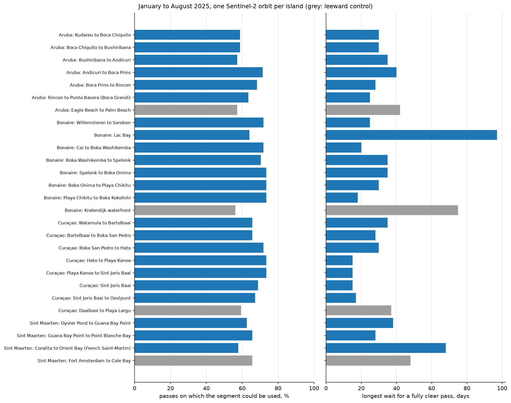

# Four Dutch Caribbean islands, one season each

Bonaire, Aruba, Curaçao and Sint Maarten, four of the six islands of the Dutch
Caribbean, each run through the same season analysis for 1 January to 31 August 2025:
same classifier and operating points, same 500 m surf zones, same 15 m land buffer and
20 m mangrove buffer, same cloud rule (a segment is blind when more than 70% of the water
side of its surf zone is cloud by the scene classification layer, partial above 20%).
Each island is counted on one Sentinel-2 relative orbit, so the islands are compared on
equal terms.

| island | tile | relative orbit | config |
|---|---|---|---|
| Bonaire | 19PEP | R082 | [`assets/islands/bonaire/island.toml`](../assets/islands/bonaire/island.toml) |
| Aruba | 19PCP | R125 | [`assets/islands/aruba/island.toml`](../assets/islands/aruba/island.toml) |
| Curaçao | 19PDP (west) and 19PEP (east) | R082 | [`assets/islands/curacao/island.toml`](../assets/islands/curacao/island.toml) |
| Sint Maarten | 20QMF | R039, and R139 reported apart | [`assets/islands/sint_maarten/island.toml`](../assets/islands/sint_maarten/island.toml) |

Curaçao is wider than one tile, so it is run in two parts on the same orbit, joined by
date. Saint Martin sits in the overlap of two orbits; R039 covers the whole island and is
the comparable run, and R139, which sees only the windward east coast on other days, has
its own table below. One Sint Maarten segment, Coralita to Orient Bay, is on the French
side and is there for context.

## In short

- Every island's windward coast was usable on 57% to 73% of passes, with a median of 5
  days between usable looks everywhere. Pooled over the windward segments: Bonaire 71%,
  Curaçao 69%, Sint Maarten's Dutch side 64% (orbit R039), Aruba 63%.
- The longest gap between two usable looks on a windward segment was 20 days on Bonaire,
  25 on Curaçao (Watamula to Bartolbaai), 30 on Aruba and 28 on Sint Maarten's Dutch side.
  On Sint Maarten that figure is partly sun glint (see below); with both orbits it is 9 to
  11 days.
- Bonaire and Curaçao are on the same orbit and are imaged on the same mornings. Every
  windward segment at once was blind on 9 of Bonaire's mornings and 12 of Curaçao's; on
  12 of Aruba's 63 passes and 20 of Sint Maarten's 64.
- The leeward controls on the three ABC islands were usable less often than their windward
  coasts (56% to 59%): cumulus forms over the lee of each island. They flagged no pixel all
  season; Sint Maarten's flagged one.
- Sint Joris Baai, Curaçao's windward lagoon, seen on the same mornings from the same orbit
  as Lac Bay, never went more than 15 days without a fully clear pass. Lac Bay went 97.
  Whatever keeps Lac Bay partial for so long is not simply being a lagoon on a windward
  coast.
- The mangrove mask matters on two islands. On Bonaire it removes Lac Bay's and Cai's
  mangrove fringe ([lac_bay_mangroves.md](lac_bay_mangroves.md)); on Curaçao it removes
  2,455 water-side pixels from Sint Joris Baai, where flagged pixels fall from 25 to 6 and
  one blind pass becomes partial. On Aruba and Sint Maarten it removes nothing, and those
  runs reproduce the rows of runs made without it cell for cell.

## Which granules count as passes

Each part of an island names the Sentinel-2 tiles and relative orbits it reads in its
`island.toml`. The search leaves out granules reported as 100% cloud. Of the rest, only
granules on those tiles and orbits are kept, one per datatake (when a datatake was
published twice, the granule covering most of the least-covered surf zone, ties to the
later processing), and only if its data footprint covers at least 99% of every segment's
surf zone: anything less would read as no-data over the rest of a zone, which counts as
cloud and would turn a pass that never looked at the coast into a blind look. Every
granule left out is listed with the reason in the island's report. Aruba lost one
duplicate (22 August), Sint Maarten one on R039 and two on R139, Bonaire and Curaçao none.

## Per segment

"Usable" is observed plus partial. "Longest gap" is the most days between two usable
looks. "Longest wait for a fully clear pass" is the most days between two passes on which
the segment was observed in full. "Passes with flags" counts usable passes with at least
one patch of 4 or more pixels the classifier called sargassum at a calibrated 0.9; a
flagged pixel is not confirmed sargassum. "Stationary" pixels were flagged on at least half
of the 5 or more passes that saw them; "near persistent vegetation" means on or within
20 m of a pixel that looked like leaf canopy on at least 90% of 10 or more clear looks.

<!-- islands-table:start -->
| island | segment | exposure | usable | longest gap, days | longest wait for a fully clear pass | passes with flags | pixels ever flagged | of which stationary | of which near persistent vegetation |
|---|---|---|---|---|---|---|---|---|---|
| Aruba | Kudareu to Boca Chiquito | windward | 59% (37/63) | 15 | 30 days (8 Jun to 8 Jul) | 0 | 0 | 0 | 0 |
| Aruba | Boca Chiquito to Bushiribana | windward | 59% (37/63) | 30 | 30 days (8 Jun to 8 Jul) | 0 | 0 | 0 | 0 |
| Aruba | Bushiribana to Andicuri | windward | 57% (36/63) | 25 | 35 days (3 Jun to 8 Jul) | 0 | 2 | 0 | 0 |
| Aruba | Andicuri to Boca Prins | windward | 71% (45/63) | 15 | 40 days (24 May to 3 Jul) | 1 | 31 | 0 | 0 |
| Aruba | Boca Prins to Rincon | windward | 68% (43/63) | 17 | 28 days (1 Apr to 29 Apr) | 0 | 0 | 0 | 0 |
| Aruba | Rincon to Punta Basora (Boca Grandi) | windward | 63% (40/63) | 15 | 25 days (29 Apr to 24 May) | 0 | 0 | 0 | 0 |
| Aruba | Eagle Beach to Palm Beach | leeward | 57% (36/63) | 20 | 42 days (30 Mar to 11 May) | 0 | 0 | 0 | 0 |
| Bonaire | Willemstoren to Sorobon | windward | 72% (46/64) | 15 | 25 days (27 Mar to 21 Apr) | 1 | 12 | 0 | 0 |
| Bonaire | Lac Bay | windward | 64% (41/64) | 20 | 97 days (12 Mar to 17 Jun) | 8 | 204 | 1 | 151 |
| Bonaire | Cai to Boka Washikemba | windward | 72% (46/64) | 15 | 20 days (21 Apr to 11 May) | 4 | 69 | 0 | 18 |
| Bonaire | Boka Washikemba to Spelonk | windward | 70% (45/64) | 15 | 35 days (17 Mar to 21 Apr) | 3 | 41 | 0 | 0 |
| Bonaire | Spelonk to Boka Onima | windward | 73% (47/64) | 15 | 35 days (17 Mar to 21 Apr) | 2 | 24 | 0 | 0 |
| Bonaire | Boka Onima to Playa Chikitu | windward | 73% (47/64) | 15 | 30 days (7 Jun to 7 Jul) | 0 | 5 | 0 | 0 |
| Bonaire | Playa Chikitu to Boka Kokolishi | windward | 73% (47/64) | 15 | 18 days (29 Mar to 16 Apr) | 0 | 13 | 0 | 0 |
| Bonaire | Kralendijk waterfront | leeward | 56% (36/64) | 20 | 75 days (12 Mar to 26 May) | 0 | 0 | 0 | 0 |
| Curaçao | Watamula to Bartolbaai | windward | 66% (42/64) | 25 | 35 days (16 Apr to 21 May) | 3 | 216 | 0 | 0 |
| Curaçao | Bartolbaai to Boka San Pedro | windward | 66% (42/64) | 15 | 28 days (7 Jun to 5 Jul) | 2 | 26 | 0 | 0 |
| Curaçao | Boka San Pedro to Hato | windward | 72% (46/64) | 15 | 30 days (22 Mar to 21 Apr) | 4 | 88 | 0 | 0 |
| Curaçao | Hato to Playa Kanoa | windward | 73% (47/64) | 10 | 15 days (11 May to 26 May) | 1 | 28 | 0 | 0 |
| Curaçao | Playa Kanoa to Sint Joris Baai | windward | 73% (47/64) | 15 | 15 days (11 May to 26 May) | 1 | 15 | 0 | 0 |
| Curaçao | Sint Joris Baai | windward | 69% (44/64) | 15 | 15 days (11 May to 26 May) | 1 | 6 | 0 | 0 |
| Curaçao | Sint Joris Baai to Oostpunt | windward | 67% (43/64) | 15 | 17 days (21 May to 7 Jun) | 0 | 6 | 0 | 0 |
| Curaçao | Daaibooi to Playa Largu | leeward | 59% (38/64) | 15 | 37 days (11 May to 17 Jun) | 0 | 0 | 0 | 0 |
| Sint Maarten | Oyster Pond to Guana Bay Point | windward | 62% (40/64) | 28 | 38 days (15 Apr to 23 May) | 0 | 1 | 0 | 0 |
| Sint Maarten | Guana Bay Point to Point Blanche Bay | windward | 66% (42/64) | 28 | 28 days (15 Apr to 13 May) | 0 | 5 | 0 | 0 |
| Sint Maarten | Coralita to Orient Bay (French Saint-Martin) | windward | 58% (37/64) | 30 | 68 days (26 Mar to 2 Jun) | 1 | 10 | 0 | 0 |
| Sint Maarten | Fort Amsterdam to Cole Bay | leeward | 66% (42/64) | 28 | 48 days (26 Mar to 13 May) | 0 | 1 | 0 | 0 |

The whole windward coast on the same pass:

- Aruba: on 63 pass dates, every windward segment was usable on 27, fully clear on 12, and every one was blind on 12.
- Bonaire: on 64 pass dates, every windward segment was usable on 32, fully clear on 9, and every one was blind on 9.
- Curaçao: on 65 pass dates, every windward segment was usable on 27, fully clear on 9, and every one was blind on 12.
- Sint Maarten: on 64 pass dates, every windward segment was usable on 33, fully clear on 9, and every one was blind on 20.

Sint Maarten, windward, second orbit R139 (tile 20QMF, orbit R139), not part of the comparison:

| island | segment | exposure | usable | longest gap, days | longest wait for a fully clear pass | passes with flags | pixels ever flagged | of which stationary | of which near persistent vegetation |
|---|---|---|---|---|---|---|---|---|---|
| Sint Maarten | Oyster Pond to Guana Bay Point | windward | 77% (49/64) | 15 | 20 days (30 Jan to 19 Feb) | 14 | 579 | 0 | 0 |
| Sint Maarten | Guana Bay Point to Point Blanche Bay | windward | 80% (51/64) | 13 | 25 days (30 Jan to 24 Feb) | 20 | 548 | 0 | 0 |
| Sint Maarten | Coralita to Orient Bay (French Saint-Martin) | windward | 77% (49/64) | 15 | 15 days (20 May to 4 Jun) | 23 | 1,353 | 0 | 0 |

Flagged pixels per million usable pixel looks, before April and from April:

| coast, orbit | flagged per million usable pixel looks, Jan to Mar | Apr to Aug |
|---|---|---|
| Aruba windward, R125 | 15 | 0.0 |
| Aruba leeward control | 0.0 | 0.0 |
| Bonaire windward without lagoons, R082 | 20 | 15 |
| Bonaire, Lac Bay | 679 | 299 |
| Bonaire leeward control | 0.0 | 0.0 |
| Curaçao windward without lagoons, R082 | 7.6 | 43 |
| Curaçao, Sint Joris Baai | 0.0 | 9.0 |
| Curaçao leeward control | 0.0 | 0.0 |
| Sint Maarten windward, R039 | 1.2 | 11 |
| Sint Maarten leeward control | 2.9 | 0.0 |
| Sint Maarten windward, R139 (not comparable) | 12 | 2,027 |
<!-- islands-table:end -->

The table is written by `python scripts/compare_islands.py --write` from the season
outputs in this folder (`docs/<island>_season.csv` and `.json`), and `islands.json` holds
the same numbers. Each island's own report has the pass-by-pass detail:
[Bonaire](bonaire_season.md), [Aruba](aruba_season.md),
[Curaçao west](curacao_west_season.md), [Curaçao east](curacao_east_season.md),
[Sint Maarten](sint_maarten_season.md) and its
[second orbit](sint_maarten_r139_season.md).

## Sun glint is part of observability

Each island is counted on one orbit, but the orbits do not look at the islands the same
way. In the morning the sun is in the east. An island on the east side of its orbit's
swath is seen from the west, looking towards the sun's reflection on the sea, and in
summer, with the sun close to the zenith, that is glint: the water brightens in every band,
the scene classification layer calls some of it cloud, and floating vegetation loses its
contrast. `python scripts/eval_glint.py` measures it per pass, from the granule metadata
(the glint angle at the windward coast, the angle between the sensor and the sun's mirror
direction) and from the image (the median 1.6 um reflectance over open water a few
kilometres offshore, where clear water reflects almost nothing). Per-pass values are in
[`glint.csv`](glint.csv).

| island, orbit | view zenith at the coast | glint angle, median (min) | passes under 20 degrees | offshore B11, Jan to Mar | offshore B11, Apr to Aug |
|---|---|---|---|---|---|
| Sint Maarten, R039 (comparable run) | 9.6 | 10.7 (7.3) | 49 of 64 | 0.027 | 0.102 |
| Aruba, R125 | 4.3 | 18.0 (14.6) | 47 of 63 | 0.034 | 0.078 |
| Bonaire, R082 | 1.9 | 24.5 (21.5) | 0 of 64 | 0.029 | 0.053 |
| Curaçao east, R082 | 6.8 | 28.5 (26.1) | 0 of 64 | 0.021 | 0.046 |
| Curaçao west, R082 | 9.6 | 32.2 (29.7) | 0 of 64 | 0.020 | 0.038 |
| Sint Maarten, R139 (second orbit) | 11.4 | 32.7 (29.7) | 0 of 64 | 0.008 | 0.035 |

Sint Maarten is the clear case, because it is the only island seen from both sides. On 16
mornings two satellites passed it about 10 minutes apart: Sentinel-2B on R139, looking from
the east, and Sentinel-2A on R039, looking from the west. On those mornings R039 recorded
about twice the cloud over the windward surf zones (a mean scene-classification cloud
share of 0.35 to 0.53 per segment, against 0.21 to 0.24 on R139) and flagged no pixel,
where R139 flagged 437 to 846 per segment. On 4 June 2025 R139 flagged 224 windward pixels
with a floating-vegetation spectrum (B04 0.064, B05 0.122, B08 0.159, B11 0.043). Minutes
later on R039 the same pixels read B04 0.162, B08 0.226 and B11 0.150, none was flagged,
and the ordinary surf-zone water around them was 0.04 to 0.06 brighter in every band, the
1.6 um band included (`python scripts/eval_glint.py --pair`). A flat offset that reaches
1.6 um is glint, not haze. On passes with less than 10% tile cloud, R039's windward
segments still averaged 12% to 32% cloud, against 4% to 7% on R139.

So observability from a single glint-prone orbit undercounts what can be seen. On R039
alone Sint Maarten's Dutch windward segments were usable on 62% and 66% of passes with
gaps of up to 28 days; on R139 alone on 77% and 80%; and with both orbits they had a
usable look on 78 and 82 of the 112 days a satellite passed, with no gap longer than 9 and
11 days. The main table keeps one orbit per island so the islands compare on equal terms,
and Sint Maarten's figures there are pessimistic for that reason.

Aruba's orbit is the next most glint-prone. Its observability is not much affected: on
the nine passes with less than 10% tile cloud its windward segments averaged 3% to 11%
cloud and none went blind. Its detections may be (next section).

## The detection side

Flags are pixels at calibrated probability 0.9 or more. None of them is confirmed
sargassum, and no pixel on any island has been checked against a beach. The rates per
million usable pixel looks are in the last table above.

- **Sint Maarten, on the glint-free orbit, shows a large step from April.** R139 flagged 12
  windward pixels in January to March and 154 in April, 1,391 in May, 1,105 in June, 902
  in July and 628 in August, with no pixel stationary. That fits drifting and accumulating
  material, and the timing matches the Nature Foundation Sint Maarten's report of 27 May
  2025 that a new wave of sargassum was hitting the island's shorelines "more heavily than
  usual", naming Guana Bay, Gibbs Bay, Dawn Beach and Oyster Pond among others on the
  Dutch side and Orient Bay and Le Galion among others on the French side
  ([naturefoundationsxm.org](https://naturefoundationsxm.org/heavy-sargassum-influx-begins-landing-on-sint-maartens-shores/)).
  It is still not confirmed: nobody has matched a flagged pixel to a beach. The
  comparable orbit, R039, flagged 16 windward pixels all season.
- **Curaçao, also glint-free, rises from a very low base.** Its open windward coast went
  from 7.6 to 43 flags per million, most of it Watamula to Bartolbaai (3 to 145 per million,
  much of it thin streaks off Watamula on 21 April) and Boka San Pedro to Hato. NTR's
  Caribbean Network reported on 14 May 2025 that the north coast was being flooded with
  sargassum, worst at Ascension Bay
  ([caribbeannetwork.ntr.nl](https://caribbeannetwork.ntr.nl/2025/05/14/mayday-for-sea-turtles-sargassum-crisis-hits-curacao-hard/));
  the segment that holds Boka Ascension, Bartolbaai to Boka San Pedro, flagged no more from
  April (14 per million) than before (18). Read as it is: on Curaçao the model picked up
  little, including at a bay where an arrival was reported.
- **Aruba went from 15 flags per million to none** in the months its orbit glints most, and
  Bonaire's open windward coast from 20 to 15. Curaçao, on Bonaire's orbit but on the
  glint-free side of it, did not drop. That is consistent with summer glint suppressing the
  classifier on Aruba, and it is also consistent with little sargassum reaching Aruba's
  windward coast; these runs cannot tell the two apart. **Aruba's quiet season cannot be
  scored as a clean coast.** What Aruba does show is that the classifier does not raise
  false alarms on an exposed, dry windward coast: 31 distinct pixels flagged in 63 passes,
  29 of them one patch in a cove about 1 km south of Conchi on 10 March, flagged once, with
  a red-edge jump and low shortwave infrared, as floating vegetation has.
- **Bonaire's Lac Bay** still flags more than any open coast after the mangrove mask, and
  most of what is left sits on canopy the map missed
  ([lac_bay_mangroves.md](lac_bay_mangroves.md)).



## What this does not say

No pixel on any island has been checked against the beach, and MARIDA, which the
classifier was trained on, has no scene from any of these islands. The observability
columns do not depend on the classifier and are the ones to trust first. The detection
columns are upper bounds on what the classifier would raise as an alarm on that coast,
not counts of sargassum.

Reproduce everything with:

```bash
python scripts/run_island_season.py --island bonaire
python scripts/run_island_season.py --island aruba
python scripts/run_island_season.py --island curacao        # both parts
python scripts/run_island_season.py --island sint_maarten   # both orbits
python scripts/compare_islands.py --write
```
