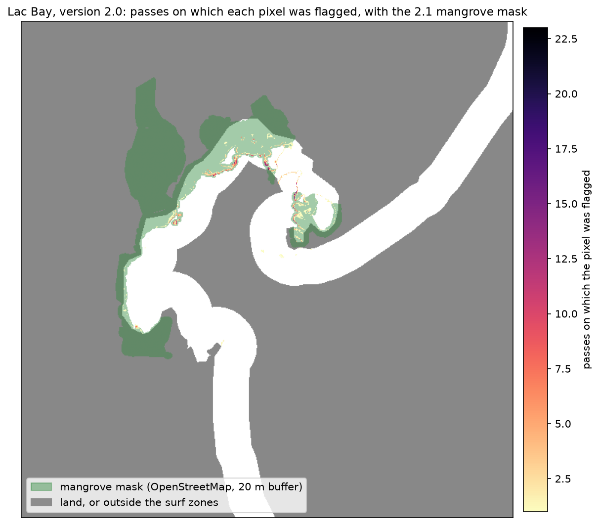

# Lac Bay: the flags were mangroves

The 2.0 season run over Bonaire flagged 1,167 distinct pixels in Lac Bay as sargassum
between January and August 2025, most of them in January, months before the Easter
influx the island reported. The report described them as "the shallow back-bay of Lac,
the reef flat at Cai and the mangrove edge", [RESULTS.md](RESULTS.md) said they were "not
a stationary confuser" and called sargassum held in the bay "the plausible reading". That
was wrong. Most of those flags are mangrove canopy and its edge, which the runner
classified because its land mask left the forest on the water side.

This page is what went wrong, the evidence, the fix in version 2.1, what the fix changes,
and the two events that are still candidates and are not confirmed.

- [What went wrong](#what-went-wrong)
- [The evidence](#the-evidence)
- [The fix](#the-fix)
- [Bonaire before and after](#bonaire-before-and-after)
- [Two candidates, not confirmed](#two-candidates-not-confirmed)
- [Limits](#limits)
- [Reproducing it](#reproducing-it)

## What went wrong

The runner removes land with the OpenStreetMap coastline polygon buffered 15 m seaward,
and classifies every non-cloud pixel on the other side. At Lac Bay the OpenStreetMap
coastline runs round the *landward* edge of the mangrove forest, so about 86 ha of canopy
that is vegetated on at least 90% of clear passes sat inside the Lac Bay surf zone, on the
water side. 58 ha of OpenStreetMap's own `wetland=mangrove` polygons were on the water side
of the land mask.

The classifier was trained on MARIDA, which has no land class and no mangrove class, and
whose only bright vegetation is sargassum. It does not call pure canopy sargassum: pure
canopy scores 0 and lands in the uncertain band, which in Lac Bay is the forest itself. It
calls the canopy *edge* sargassum, where a 10 m pixel is part leaf and part water. Such a
pixel crosses the 0.90 edge on clean passes and drops back on hazy ones, so the flags hop
from pass to pass while the forest stays put.

The stationarity check in the 2.0 report missed this because it counts flags, not
spectra. An edge pixel scores in the uncertain band on most passes (69% of the clear looks
on which an ever-flagged pixel was not flagged) and crosses 0.90 on a few, so it is never
"flagged on half or more of its passes", although the mangrove under it never moves. Only
25 of the 1,167 pixels were stationary by that rule, and that number was read as evidence
that the flags were floating. It was not.

## The evidence

The diagnosis re-read every pass on which the Lac Bay segment was fully observed (14
passes, 2,562 flag events on 957 distinct pixels) with the runner's own reader, masks,
classifier and calibration; the flagged and usable counts matched the 2.0 season CSV on
every pass. Five independent lines point the same way.

**Where the flags sit.** Vegetated means NDVI (B08, B04) above 0.5 and B08 above 0.08;
persistent vegetation is vegetated on at least 90% of at least 10 clear passes.

| where the 2,562 flag events on 14 clear passes sit | events | share |
|---|---|---|
| on persistent vegetation (mangrove canopy) | 1,301 | 51% |
| within 20 m of it or of an OpenStreetMap mangrove polygon | 1,196 | 47% |
| 20 to 100 m from mangrove | 52 | 2% |
| over 100 m from mangrove, all in the open lagoon | 13 | 0.5% |
| on or within 60 m of the mapped reef crest | 0 | 0 |

Over the whole season, 1,091 of the 1,167 flagged pixels (93%) and all 25 stationary ones
sit on that canopy or within 20 m of it. None is on the reef crest and none is inside the
seagrass polygons OpenStreetMap maps in the bay. The share depends on the definitions, but
not much: 90% to 94% of flag events are within 20 m of persistent vegetation for NDVI
cuts from 0.3 to 0.6, falling to 78% at 0.7; with OpenStreetMap polygons alone, 82% are
within 20 m of mapped mangrove and 90% within 50 m, because the mapped outlines are coarse.

**The same places all season.** Of the 362 pixels flagged on 16 August, 271 (75%) had also
been flagged on one of the three January passes, and 347 (96%) sat within 20 m of a
January flag.

**Nothing arrives.** Material that drifts in should raise a pixel's near-infrared on the
day it is flagged. It does not:

| flag events | n | B8A on the flag day minus the pixel's own median on its other clear passes | lifted by over 0.03 |
|---|---|---|---|
| all | 2,540 | -0.009 [-0.025, +0.004] | 2% |
| on persistent vegetation | 1,301 | -0.014 [-0.032, +0.001] | 1% |
| transient, away from mangrove | 20 | +0.081 [+0.020, +0.095] | 70% |
| the 17 June lagoon patch | 11 | +0.093 [+0.088, +0.106] | 100% |

Median and interquartile range. The pixels flagged in January have the same near-infrared
on every clear pass from January to August (median B8A 0.21 to 0.24).

**The classifier flags canopy mixed with water, not canopy.** Each pass's interior canopy
spectrum was mixed with the water 30 to 100 m off the canopy in 2% steps and run through
the classifier and the calibrator. Pure canopy scores 0 on 13 of the 14 passes (0.12 on
20 February). On six passes (the three in January, 5 and 20 February, 16 August),
mixtures with 26% to 52% canopy score 0.90 or more; on the other eight, hazier or with
more glint, no mixture does. The flagged pixels' canopy share estimated from B8A is 0.31
to 0.58, inside that window. In spectral shape the flags sit between canopy and floating
vegetation: B05's share of the near-infrared excess over the sea is 0.33 for all flags,
0.25 for flags on canopy and 0.19 for interior canopy, against 0.62 for MARIDA's dense
sargassum.

**The timing follows the atmosphere.** The flag rate per clear pass tracks the haze and
glint over the open sea (Spearman -0.89 with open-sea B08, n = 14): clean January passes
flag hundreds of edge pixels, hazier summer passes tens.

| pass | open-sea B08 | visible Lac Bay pixels | flagged | per 1,000 |
|---|---|---|---|---|
| 2025-01-11 | 0.010 | 38,341 | 410 | 10.7 |
| 2025-01-16 | 0.006 | 36,798 | 557 | 15.1 |
| 2025-01-26 | 0.018 | 38,778 | 315 | 8.1 |
| 2025-02-05 | 0.019 | 34,512 | 138 | 4.0 |
| 2025-02-20 | 0.032 | 36,493 | 195 | 5.3 |
| 2025-02-25 | 0.037 | 35,099 | 75 | 2.1 |
| 2025-03-02 | 0.035 | 37,525 | 124 | 3.3 |
| 2025-03-12 | 0.038 | 32,702 | 149 | 4.6 |
| 2025-06-17 | 0.048 | 33,913 | 56 | 1.6 |
| 2025-07-05 | 0.042 | 35,073 | 49 | 1.4 |
| 2025-07-10 | 0.050 | 31,675 | 62 | 2.0 |
| 2025-07-17 | 0.046 | 32,304 | 29 | 0.9 |
| 2025-07-30 | 0.052 | 32,873 | 41 | 1.2 |
| 2025-08-16 | 0.029 | 39,205 | 362 | 9.2 |

Swapping atmospheres between passes moves the counts the same way. Adding the open-sea
difference between a summer pass and 16 January to the 557 pixels flagged on 16 January
keeps 0% to 1.3% of them flagged for the offsets from 25 February to 30 July. Giving each
summer pass the January sea instead turns its 27 to 55 flags within 20 m of mangrove into
1,129 to 1,615. A uniform offset also lands on the leaf part of a pixel, where glint does
not, so these numbers overstate the effect; the direction and size still show that a lift
of about 0.04 in every band, roughly the difference between a January and a July sea,
decides how many mangrove-edge pixels cross 0.90.

Two other analyses, with different data, agree. On the same passes the physical indices
flag the canopy itself on most passes, and 96% of the classifier's Lac Bay flags sit on
pixels FAI flags on most passes ([index_vs_model.md](index_vs_model.md)). In Sentinel-1
radar the flagged pixels are as steady over the season as unflagged canopy and show no
brightening on the day they are flagged ([sentinel1_lac.md](sentinel1_lac.md)).

## The fix

Version 2.1 removes OpenStreetMap's mapped mangrove and other vegetated wetland
(`wetland=mangrove`, `swamp`, `marsh`, `saltmarsh`, `reedbed`, `wet_meadow`), buffered
20 m, from the water side before anything is classified or counted. Seagrass beds and
untagged `natural=wetland` polygons are kept, because sargassum floats over the first and
most of the second are salt ponds on these islands. The polygons are built per island by
`scripts/make_island_segments.py` into `assets/islands/<island>/mangroves.geojson`. The
mask is on by default; `--no-mangrove-mask` reproduces 2.0.

OpenStreetMap's outlines are coarse at 10 m, so the runner also keeps a per-pixel count of
the passes on which each pixel looked like leaf canopy, and reports, per segment, how many
flagged pixels sit on or within 20 m of persistent vegetation. That check removes nothing.
It names flags that sit on canopy the map missed, so they are not quoted as sargassum.

The mask only matters where mapped mangrove sits inside a surf zone. On Bonaire that is
Lac Bay, Cai to Boka Washikemba, and a few pixels on two other segments. On Aruba and
Sint Maarten it removes no pixel from any surf zone (see [islands.md](islands.md)).

## Bonaire before and after

The same 64 passes, run again with the mask (`python scripts/run_bonaire_season.py`, on
5 October 2026), against the 2.0 run. Only the two segments with mapped mangrove in their
surf zones change in substance; the mask removes 47 and 7 water-side pixels from two
others and nothing from the rest.

| segment | version | usable passes | observed / partial / blind | longest gap, days | longest wait for a fully clear pass | passes with flags | pixels ever flagged | stationary | flag events |
|---|---|---|---|---|---|---|---|---|---|
| Lac Bay | 2.0 | 64% | 14 / 27 / 23 | 20 | 97 days (12 Mar to 17 Jun) | 24 | 1,167 | 25 | 3,508 |
| Lac Bay | 2.1 | 64% | 15 / 26 / 23 | 20 | 97 days (12 Mar to 17 Jun) | 8 | 204 | 1 | 442 |
| Cai to Boka Washikemba | 2.0 | 72% | 32 / 14 / 18 | 15 | 20 days (21 Apr to 11 May) | 10 | 285 | 5 | 550 |
| Cai to Boka Washikemba | 2.1 | 72% | 33 / 13 / 18 | 15 | 20 days (21 Apr to 11 May) | 4 | 69 | 0 | 72 |

**The observability claims stand.** Removing the canopy changes the water side over which
cloud is counted, so some verdicts move: in Lac Bay three passes went from partial to
observed and two from observed to partial, and in Cai to Boka Washikemba one went from
partial to observed. No usable share, no longest gap and no longest wait for a fully clear
pass changed. Lac Bay is still usable on 64% of passes, its longest gap between usable
looks is still 20 days, and it still had no fully observed pass between 12 March and
17 June. The other six segments are unchanged except one flagged pixel fewer on Willemstoren
to Sorobon.

**The detections mostly go.** The mask removes 8,752 water-side pixels from the Lac Bay
zone and 1,256 from Cai to Boka Washikemba. Lac Bay's flagged pixels fall from 1,167 to
204, its flag events from 3,508 to 442 (from 2,906 to 462 per million usable pixel looks),
and its stationary pixels from 25 to 1. Cai to Boka Washikemba falls from 285 to 69.

**What is left in Lac Bay is still mostly canopy.** OpenStreetMap does not map all of it:
2,849 pixels (28 ha) in the masked Lac Bay zone still looked like leaf canopy on at least
90% of their clear looks, and 151 of the 204 flagged pixels sit on or within 20 m of them.
That is what the vegetation check is for; it names those flags instead of counting them
as sargassum. Of the other 53, the two largest clusters are each flagged on one pass: 16
pixels at the lagoon mouth on 11 May, where the surf ends and foam is as likely as anything
floating, and the 11-pixel open-lagoon patch of 17 June. Next is a 9-pixel cluster in the
south-west corner by Sorobon, flagged on up to 4 passes; the rest are clusters of 1 to 3
pixels.
In Cai to Boka Washikemba, 18 of the 69 sit near persistent vegetation.



`assets/bonaire_persistence.png` shows the 2.1 run, with the mask drawn in green.

## Two candidates, not confirmed

Two events in or next to Lac Bay behave like something arriving rather than like a fixed
surface. Neither has been checked on the water, and neither is a confirmed sargassum
detection.

**17 June 2025, open lagoon.** An 11-pixel patch (0.11 ha, inside a 40 by 40 m box) at
12.1023 N, 68.2256 W, about 400 m from the nearest mangrove and 230 m inside the reef. In
true colour it is a dark brown patch that is absent on the other passes. Its spectrum has
a red-edge jump (B04 0.056 to B05 0.120), a near-infrared plateau (B08 0.18) and shortwave
infrared below the open sea (B11 0.038). By spectral angle it is closest to a floating
patch the same model flagged off Conchi on Aruba on 10 March 2025 (7.9 degrees), then to
MARIDA's sparse and dense sargassum (10.0 and 10.9), and far from the Lac canopy (22.4).
Its near-infrared was 2.8 to 4.2 times those pixels' usual level, and the spot was
cloud-free and unflagged 12 days before (5 June) and 3 days after (20 June). It could
also be another floating plant mass, such as seagrass wrack or mangrove litter, or a
vessel or object. The mangrove mask does not touch it.

**6 May 2025, west shore.** The largest radar-bright patch in the bay during the 97 days
without a fully clear optical look: 5,400 m2 at 5.3 dB in Sentinel-1 on 6 May, on the
west, leeward shore at 12.1022 N, 68.2402 W. Sentinel-2 shows a red-brown band with a
floating-vegetation signal at the same spot through cloud gaps on 8 and 11 May, and on no
other usable look of the season. It is one event, the radar patch hugs the shoreline where
the same shore gives smaller detections on four other passes, and the optical evidence
comes two and five days later through cloud. [sentinel1_lac.md](sentinel1_lac.md) has the
details.

## Limits

- The thresholds are choices: vegetated at NDVI 0.5 and B08 0.08, persistent at 90% of at
  least 10 clear passes, edge at 20 m. The headline share moves between 78% and 98% across
  reasonable choices.
- About 30% of flag events sit on the very edge of the canopy, where the spectrum alone
  cannot tell canopy plus water from sargassum plus water. Their near-infrared does not
  rise on the day they are flagged, so they are not arrivals, but floating material caught
  in the mangrove roots for weeks would look the same at 10 to 20 m.
- OpenStreetMap is volunteer-mapped. Its mangrove outlines are an independent check, not
  ground truth, and the mask will miss canopy that is not mapped. The vegetation check is
  there for that.
- MARIDA is ACOLITE Rayleigh-corrected reflectance and these passes are Sen2Cor L2A; the
  spectral comparisons were also done relative to each pass's open sea, which reduces but
  does not remove that difference.
- Nothing here establishes whether sargassum was in Lac Bay on any of these passes. A
  missing flag says little, because the classifier only fires in a narrow window that
  depends on the viewing conditions.

## Reproducing it

The 2.0 persistence grid is in the git history. Counting how much of it the 2.1 mangrove
mask covers needs no download:

```bash
git show 7d7847d:docs/bonaire_persistence.npz > bonaire_persistence_v2_0.npz  # the 2.0 run
python scripts/eval_mangrove_mask.py --island bonaire --persistence bonaire_persistence_v2_0.npz
```

The season itself reruns with `python scripts/run_island_season.py --island bonaire`, or
with `--no-mangrove-mask` for the 2.0 behaviour.
